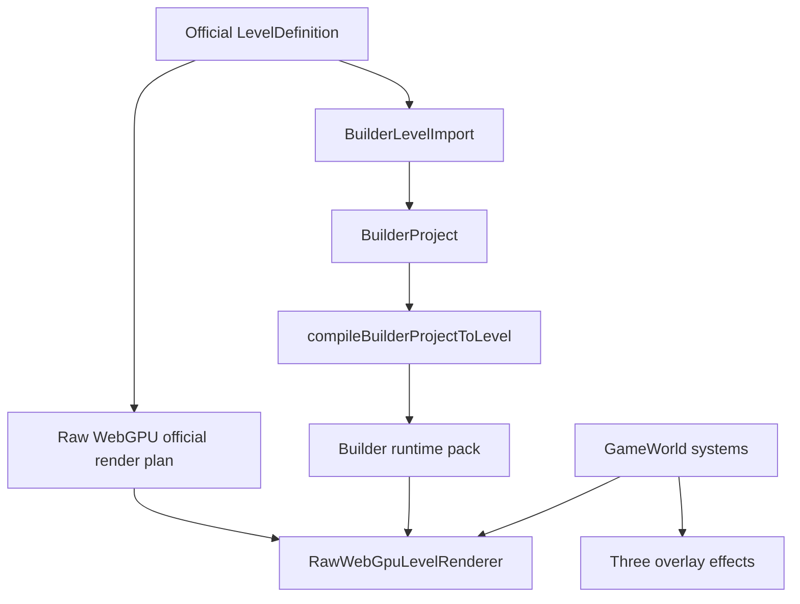
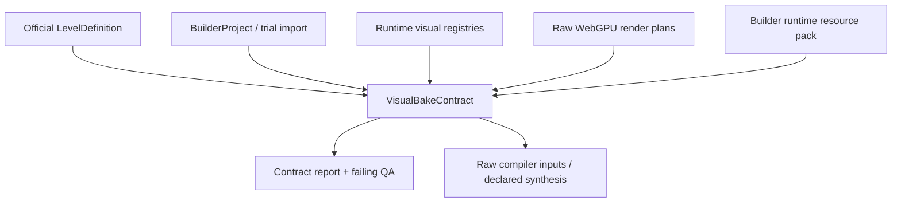

# Human Protocol Build Runtime Deep Research Brief

## Current Pain

Level 3 exposes a structural problem, not only a few visual bugs:

- Official maps, imported `/build` projects, builder runtime packs, and Raw WebGPU plans can each synthesize room shell, props, doors, pickups, robots, and effects.
- Some visual geometry is implicit. A room can say `renderWalls:false`, but the Raw compiler can still add a ceiling panel unless a separate contract says not to.
- Trial `/build` data can carry generated props that official config does not own.
- Runtime visuals can reuse gameplay pickup assets for skill objects, making a bomb look like an energy pickup.
- Playtest packs can be cached, so a page can appear unchanged even after generated manifests or runtime code changed.

The maintenance goal should be one inspectable visual/runtime contract per level and one set of reusable bake verbs.

## Pipeline Map



## Core Files

Official Level 3 nouns:

- `src/game/config/levels/level03-human-museum/map.ts`
- `src/game/config/levels/level03-human-museum/level.ts`
- `src/game/config/levels/level03-human-museum/puzzles.ts`
- `src/game/config/levels/level03-human-museum/waves.ts`
- `src/game/config/levels/level03-human-museum/presentation.ts`

Builder import and trial path:

- `src/build/BuilderLevelImport.ts`
- `src/build/compileBuilderProjectToLevel.ts`
- `src/build/BuildPage.tsx`
- `src/build/BuilderPlaytestPackControls.tsx`
- `src/build/runtime-pack/generateBuilderPlaytestPack.ts`
- `src/build/runtime-pack/BuilderRuntimePackStore.ts`
- `data/ai/campaign/rb_l3.builder.json`
- `scripts/ai/buildCampaign.ts`
- `src/build/devGenerateRoom.ts`

Asset ownership and deep bake:

- `src/build/runtime-pack/BuilderRuntimeAssetIndex.ts`
- `src/build/runtime-pack/compileBuilderRuntimePack.ts`
- `tools/raw-webgpu-compiler/compile-builder-runtime-resource-pack.mjs`
- `tools/raw-webgpu-compiler/compile-raw-webgpu-render-plan.mjs`
- `tools/raw-webgpu-compiler/raw-webgpu-builder-surfaces.mjs`
- `tools/raw-webgpu-compiler/raw-webgpu-plan-instances.mjs`
- `tools/raw-webgpu-compiler/raw-webgpu-plan-geometry.mjs`
- `tools/raw-webgpu-compiler/raw-webgpu-render-plan-rules.mjs`

Raw WebGPU runtime:

- `src/render/raw-webgpu/RawWebGpuLevelRenderer.ts`
- `src/render/raw-webgpu/RawViewmodelMode.ts`
- `src/render/raw-webgpu/RawViewmodelPass.ts`
- `src/render/raw-webgpu/RawGpuParticlePass.ts`
- `src/render/raw-webgpu/RawProjectileVfxPass.ts`
- `src/render/raw-webgpu/RawRoomRuntime.ts`

Skill 3 runtime and effects:

- `src/game/config/ultimateAbilityConfig.ts`
- `src/game/core/GameWorld.ts`
- `src/game/systems/InputSystem.ts`
- `src/game/systems/EffectsSystem.ts`
- `src/render/effects/UltimateAbilityRenderer.tsx`
- `src/render/effects/BatchedEffects.tsx`
- `src/render/effects/EffectsLayer.tsx`

QA and contracts:

- `scripts/qa/level3-visual-contract.mjs`
- `scripts/qa/builder-wgpu-resource-audit.mjs`
- `src/build/BuilderOfficialRoundTrip.test.ts`
- `src/game/systems/CombatRules.test.ts`
- `docs/LEVEL3_BUILD_OFFICIAL_CONTRACT.md`

Generated outputs that must be treated as products of source contracts:

- `src/assets/manifests/generated/raw-webgpu/render_plan_level_03_human_museum.json`
- `src/assets/manifests/generated/raw-webgpu/render_plan_builder_runtime_resources.json`
- `src/assets/manifests/generated/raw-webgpu/qa/level3_visual_contract_report.json`
- `public/assets/human-protocol/raw-webgpu/**`

## Structural Questions

1. What is the single source of truth for a room shell: official `LevelDefinition.geometry`, builder `room.env`, presentation kits, or Raw compiler defaults?
2. Which compiler is allowed to synthesize visual geometry, and how does it declare that synthesis back into a diffable contract?
3. Should `/build?fromLevel=...` play current official config directly, or a generated builder project derived from official config?
4. How should cached playtest packs be invalidated when runtime code, Raw compiler code, or generated resources change?
5. What asset roles are legal for each semantic object: pickup, skill item, shell, door, route console, robot, viewmodel?
6. How do we prevent GLB material fallback from silently turning props/robots/consoles white?
7. How do skill systems register visuals once, so Raw WebGPU, Three overlay, builder pack, and QA agree?
8. Which QA checks are contract-level, and which require live browser screenshot / pixel verification?

## Proposed Target Architecture

Create a `VisualBakeContract` layer that is generated before Raw WebGPU compilation and used by both official and builder paths.

The contract should include:

- Rooms: shell parts explicitly on/off (`floor`, `walls`, `ceiling`, `wallWash`, `pillars`).
- Objects: semantic role, modelKey/proceduralKey, owner (`official`, `builder`, `runtime`, `generated`).
- Assets: source GLB, cooked GLB, material policy, color policy, fallback policy.
- Runtime visuals: viewmodel/deployed/effect keys for skills and weapons.
- Pack identity: hash of project data, official source version, compiler version, runtime visual version, and resource manifests.
- QA assertions: no implicit exit fixtures, no white material fallbacks for named roles, required robot resources, required hero props, no skill pickup reuse.

## Next Codex Session Scope

Build the first reusable VisualBakeContract runner instead of extending the Level 3-only script.

Target command shape:

```bash
npm run qa:visual-bake-contract
```

Target files:

- `scripts/qa/visual-bake-contract.mjs` for the generic runner.
- `scripts/qa/visual-bake-contract/` for reusable inspectors if the file gets large.
- `src/assets/manifests/generated/raw-webgpu/qa/visual_bake_contract_report.json` for the all-level report.
- Keep `scripts/qa/level3-visual-contract.mjs` only as a compatibility wrapper or fixture until the generic runner fully covers its checks.

The runner should validate all official campaign levels, not just Level 3:

- Load official `LevelDefinition` configs.
- Import each official level through `builderProjectFromBuiltInLevel` when supported.
- Inspect generated official Raw WebGPU render plans.
- Inspect `render_plan_builder_runtime_resources.json` and builder WGPU source maps.
- Compare semantic objects by role/modelKey instead of raw instance id wherever possible.
- Allow level fixtures only for intentional hero objects, e.g. Level 3's three museum exhibits.

The first generic contract should include these gates:

- Required official modelKeys are present in the official Raw plan and the builder/deep-bake resource map.
- Interactions with cooked modelKeys do not fall back to white/proxy cubes or pure-white material roles.
- Robots have native `hp_enemy_*` cooked resources in the builder runtime resource path.
- Skill/viewmodel/deployed runtime visuals are registered once and are not reused from pickup assets unless explicitly allowed by role.
- Exit rooms do not receive hidden duplicate pads, high-opacity floor glows, ceiling fixtures, wall-wash fixtures, or generated residential lamps unless the contract declares them.
- Trial `/build` imports should reflect official config semantics; when a trial diverges, the report should name the semantic role and source layer (`official`, `builder-import`, `trial-json`, `raw-plan`, `runtime-pack`).

What not to do in that session:

- Do not fix each discovered level by patching generated Raw JSON.
- Do not special-case Level 3 ids in renderer code.
- Do not treat Three.js preview success as acceptance.
- Do not make `/build` runtime cook missing GLBs on the fly as the normal path.

The intended long-term shape is:



## VisualBakeContract Runner

First implementation:

```bash
npm run qa:visual-bake-contract
```

The all-level report is written to:

```text
src/assets/manifests/generated/raw-webgpu/qa/visual_bake_contract_report.json
```

The compatibility Level 3 command still exists, but now calls the generic runner in focused mode:

```bash
npm run qa:level3:visual-contract
```

Its focused report remains:

```text
src/assets/manifests/generated/raw-webgpu/qa/level3_visual_contract_report.json
```

Current coverage:

- Formal official campaign levels `level_01_maintenance_bay` through `level_05_reclamation_core`.
- Source layers: `official`, `builder-import`, `trial-json`, `raw-plan`, and `runtime-pack`.
- Official Raw plans: `src/assets/manifests/generated/raw-webgpu/render_plan_<level>.json`.
- Builder runtime resource plan: `render_plan_builder_runtime_resources.json`, plus the shared builder WGPU source map.
- Trial data: `data/ai/campaign/rb_l1` through `rb_l5` `.builder.json` and `.level.json`.
- Runtime visual registration for Skill 3 / `coreBomb`.

Report schema shape:

- `schemaVersion`: currently `human-protocol/visual-bake-contract@1`.
- `coverage`: covered level ids and source layers.
- `inputs`: exact manifest/config/trial paths consumed.
- `levels[]`: per-level counts and drift summaries.
- `checks[]`: pass/fail/warn gate results with source-layer tags.
- `findings[]`: errors and warnings with `levelId`, `semanticRole`, `sourceLayer`, and `sourceLayers`.

Current hard gates:

- Builder WGPU source index modelKeys must have at least one ready Raw/runtime resource source.
- Builder runtime resources must include native cooked `hp_enemy_*` robot resources.
- Skill 3 must use `ability_protocol_breach_charge_v1` for held/deployed visuals, spend on throw, and avoid pickup/proxy assets.
- Raw instances must have ready geometry assets unless they are declared procedural placeholders.
- Exit rooms must not receive undeclared hidden fixture geometry, duplicate exit pads/panels, or high-opacity floor glows.
- Level 3 hero exhibit, route console, route material, and clean elevator-kit fixtures remain guarded as level fixtures, not renderer hardcode.
- Level 3 official surface presets must match across official config, builder import/trial JSON, Raw plan, and runtime-pack semantics. The current official target is `floor_photo_marble`, `wall_hp_museum_limestone_panel`, and `ceiling_hp_museum_coffered_limestone`.
- Level 3 official Raw plans must declare `officialBuilderSurfaceBridge.enabled`, include `builder:floor:*`, `builder:walls:*`, and `builder:ceiling:*` instances for the seven non-exit museum rooms, include the copied base-color sources `white_marble_color.webp`, `hp_wall_museum_limestone_panel_color.webp`, and `hp_ceiling_museum_coffered_limestone_color.webp`, and omit the old shell surface tokens.

## Official Builder Surface Bridge

The June 2026 Level 3 surface drift was not caused by verify overwriting the source files. The exported `/build` JSON held the intended room surface presets in `authoringMetadata.builderEnvironment.rooms`, while the official Raw compiler still baked shell GLBs from the presentation kit and ignored those builder surface overrides. A second render-time overlay, the Level 3 hero floor, could also cover the baked floor with an older texture.

Current bridge behavior:

- `src/game/config/levels/level03-human-museum/level.ts`, `data/ai/campaign/rb_l3.builder.json`, `data/ai/campaign/rb_l3.level.json`, and `src/build/devRemakeProjects.ts` carry the same builder surface presets.
- `src/build/official-bridge/SurfaceKitBridge.ts` maps the official museum kit to the same default presets while keeping legacy Level 3 shell preset pairs importable as aliases.
- `tools/raw-webgpu-compiler/compile-raw-webgpu-render-plan.mjs` asks `builderProjectFromBuiltInLevel` for the official builder project and passes it into `raw-webgpu-builder-surfaces.mjs`.
- `raw-webgpu-builder-surfaces.mjs` reuses `compileBuilderRuntimePack` output as the authoritative procedural surface bake: it removes shell floor/wall/ceiling instances for non-exit rooms with authored overrides, appends the matching surface vertices/materials/base-color texture layers, and records `officialBuilderSurfaceBridge` in the render plan.
- `src/render/raw-webgpu/RawRoomRuntime.ts` suppresses the legacy Level 3 hero-floor overlay when the bridge is enabled.

This keeps the official admin path and `/build` trial path on one semantic surface source. Future edits from an exported official `/build` JSON should update source config/trial data and rebuild; generated Raw JSON remains an output.

Current drift warnings:

- Official-to-Raw missing modelKeys are reported without patching generated Raw JSON.
- Builder import compile/validation drift is reported by level and source layer.
- Trial JSON prop modelKey drift is reported against official config for both `.builder.json` and `.level.json`.

UI trigger direction:

- Add a `/build` inspector action that runs the same semantic checks after official import or playtest-pack generation.
- Surface warnings by source layer (`official`, `builder-import`, `trial-json`, `raw-plan`, `runtime-pack`) instead of exposing raw JSON dumps.
- Link each warning to the report entry and the source object id/modelKey.
- Keep automatic official-content sync out of the UI until a sync plan can prove the official config, imported builder project, and trial JSON agree.

## Deep Research Prompt

Research and propose a maintainable architecture for Human Protocol's official-level, builder `/build`, asset baking, and Raw WebGPU runtime pipeline.

Context:

- The game has official `LevelDefinition` configs and an editable `/build` builder that can import official levels through `BuilderLevelImport.ts`.
- Builder projects compile back into playable levels through `compileBuilderProjectToLevel.ts`.
- Raw WebGPU uses generated render plans from `tools/raw-webgpu-compiler/*`.
- Builder playtests use runtime packs generated by `src/build/runtime-pack/*` and cached through `BuilderRuntimePackStore.ts`.
- Level 3 has repeatedly regressed with white elevator-room geometry, white route-console materials, robot proxy cubes, and skill 3 visuals reusing pickup assets.

Goals:

- Design one source-of-truth contract for official config, builder project, cooked GLB assets, generated Raw WebGPU manifests, and runtime visuals.
- Separate reusable verbs from level nouns.
- Remove hidden synthesis that adds room shell/props/effects outside the contract.
- Define cache invalidation for playtest packs when source config, compiler code, renderer code, or asset manifests change.
- Define asset-role validation so props, robots, pickups, viewmodels, skills, and procedural visuals cannot accidentally reuse or fallback to the wrong model.
- Define QA gates including manifest-level checks and browser/pixel checks for Raw WebGPU.

Deliverables:

- A module/file ownership diagram.
- A phased refactor plan with low-risk checkpoints.
- A schema proposal for `VisualBakeContract`.
- A cache/versioning strategy for builder playtest packs.
- A QA matrix and commands to run before accepting Level 3 visual/runtime changes.
