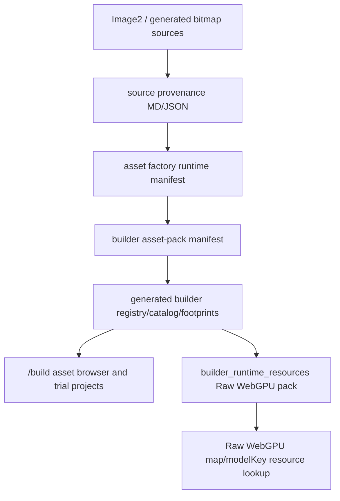

# Human Protocol Image2 Build And WebGPU Pipeline

This pipeline is reusable across Human Protocol asset families. It is not a
Level 2-only path.

## Goal

Move project-owned Image2/generated bitmap asset families into:

1. provenance/license ledgers
2. builder asset-pack manifests
3. `/build` catalog entries
4. environment `modelKey` registry entries
5. builder Raw WebGPU resource maps
6. thumbnail evidence and QA

Generated Raw WebGPU JSON is an output. Do not patch it by hand.

## Source Chain



## Required Provenance

Every Image2/generated bitmap source must record:

- prompt
- tool/model or call id when available
- generating account when known
- generation date
- source image path
- crop/region mapping
- license label and classification
- reference inputs and whether they are redistributed
- derivative outputs that depend on the source

Use this label for OpenAI-generated project output:

```text
openai-generated-output-user-owned-subject-to-openai-terms
```

Use this classification when account/date/source/prompt are recorded and the
asset is a project-generated generic bitmap source:

```text
owned-generated-output
```

If the tool does not expose call IDs, record that explicitly instead of marking
the asset as an unknown-license source.

## Builder Conversion

For runtime asset factory manifests, use:

```sh
node scripts/asset-build/convert-runtime-asset-factory-to-builder-pack.mjs \
  --input src/assets/manifests/runtime/<factory>.json \
  --output src/assets/manifests/builder/<pack>.json \
  --pack-id <pack_id> \
  --label "<display label>" \
  --group <builder group> \
  --source <source id>
```

Then validate before ingestion:

```sh
node scripts/asset-build/generate-builder-asset-pack-registry.mjs \
  --manifest src/assets/manifests/builder/<pack>.json \
  --check --pending
```

Ingest and emit generated fragments:

```sh
node scripts/asset-build/generate-builder-asset-pack-registry.mjs \
  --emit \
  --manifest src/assets/manifests/builder/<pack>.json
```

Validate integration:

```sh
node scripts/asset-build/generate-builder-asset-pack-registry.mjs \
  --manifest src/assets/manifests/builder/<pack>.json \
  --check
```

This updates:

- `src/assets/manifests/builder/ingested-packs.json`
- `src/assets/registry/environment/generatedBuilderAssetPacks.ts`
- `src/build/generatedBuilderAssetCatalog.ts`
- `src/build/generatedBuilderAssetFootprints.ts`

## Raw WebGPU Resource Map

`src/build/runtime-pack/BuilderRuntimeAssetIndex.ts` registers all
`builderPropCatalog` furniture for the builder Raw WebGPU resource pack. After
builder emit, rebuild:

```sh
node tools/raw-webgpu-compiler/compile-builder-runtime-resource-pack.mjs
```

Acceptance:

- `issues=0`
- new `modelKey` entries appear in
  `src/assets/manifests/generated/raw-webgpu/render_plan_builder_runtime_resources.json`
- no generated Raw JSON was hand-edited

## Thumbnails

Capture only the changed modelKey prefix when possible:

```sh
node scripts/asset-build/generate-builder-asset-thumbnails.mjs --only <model_key_prefix>
```

Add a `packDirFor()` branch in
`scripts/asset-build/generate-builder-asset-thumbnails.mjs` for new reusable
families so thumbnails are not dumped into `core/`.

## 2D/3D Asset Viewer

Every new Image2 furniture/prop asset family should be reviewable through the
same local 2D/3D HTML viewer, not a one-off contact sheet. This lets us compare
builder thumbnails and the actual GLB under one consistent interaction format.

After the builder manifest and thumbnails exist, generate a viewer:

```sh
node scripts/asset-build/generate-image2-asset-viewer.mjs \
  --out .tmp/<level-or-pack>-image2-asset-viewer.html \
  --title "<Level/Pack> Image2 Asset Viewer" \
  --manifest src/assets/manifests/builder/<pack>.json
```

Multiple related packs can share one viewer by passing multiple manifests:

```sh
node scripts/asset-build/generate-image2-asset-viewer.mjs \
  --out .tmp/level01-image2-asset-viewer.html \
  --title "Level 01 Image2 家具 Viewer" \
  --manifest src/assets/manifests/builder/hp_level01_workcell_image2_v1.json \
  --manifest src/assets/manifests/builder/hp_level01_power_infra_image2_v1.json \
  --manifest src/assets/manifests/builder/hp_level01_safety_storage_image2_v1.json
```

Serve the repo root and open the generated HTML:

```sh
python3 -m http.server 5199 --bind 127.0.0.1
open http://127.0.0.1:5199/.tmp/<level-or-pack>-image2-asset-viewer.html
```

Acceptance:

- left column lists every asset from the manifest(s)
- `2D View` shows the builder thumbnail
- `3D View` loads the GLB with orbit controls
- no missing thumbnail/GLB paths in the browser console
- viewer format stays consistent across Level 1, Level 2, and future packs

## QA

Minimum checks:

```sh
node -e 'for (const f of process.argv.slice(1)) JSON.parse(require("fs").readFileSync(f,"utf8"));' <json files>
git diff --check -- <touched files>
node scripts/qa/builder-wgpu-resource-audit.mjs
```

Run `npm run qa:builder` before claiming the full `/build` surface is clean.
