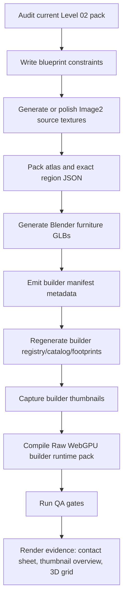

# Human Protocol Level 02 Furniture Image2 Blender Pipeline

## Decision

Level 02 Image2 furniture must stop being polished primarily through the
`trimesh` generator. The current pack is useful for build integration and
placeholder iteration, but it is not the final production line for believable
residential furniture.

The production source of truth is:

1. blueprint and math constraints
2. clean Image2 material/trim evidence
3. deterministic Blender generation
4. GLB export with bevels, weighted normals, grounded pivots, named parts, and
   named material slots
5. builder manifest/registry/catalog/footprint regeneration
6. builder thumbnails with neutral studio lighting
7. Raw WebGPU builder runtime pack compilation
8. QA and visual evidence

This follows the repo-wide furniture factory rule in
`docs/human-protocol-furniture-asset-factory-pipeline.md`: GPT/Image2 can help
with concept, specification, script scaffolding, texture evidence, and QA
pressure, but Blender and deterministic scripts own production geometry.

## Research Report Addendum

The local research report
`/Users/zhengkaizhang/Downloads/GPT 驱动的 3D 家具资产与游戏道具生产方案研究报告 (1).pdf`
reinforces the same production stance:

- GPT is most reliable as a technical-art coordinator: asset specs, parameter
  tables, Blender/Houdini/Substance/import scripts, naming, metadata, and QA.
- Text-to-3D or image generation may support ideation, silhouettes, material
  boards, and variant exploration; it must not become the direct final mesh.
- DCC sources plus deterministic scripts are the production source of truth.
- Web/runtime delivery should prefer GLB plus compact material sets, with
  texture/atlas budgets and generated runtime packs rebuilt from source.
- Every production asset should carry enough metadata to audit scale, style,
  platform target, material roles, collision/LOD intent, and AI/reference use.

For this pack, that means the Level 02 generator must output not only GLBs, but
also a report that records blueprints, material palette roles, budget decisions,
hidden-control rules, and QA evidence.

## Why The Current Level 02 Pack Is Not Enough

Current build-facing source:

- `scripts/asset-build/generate-level02-furniture-image2-assets.py`
- `src/assets/manifests/builder/hp_level02_furniture_image2_v1.json`
- `src/assets/models-cooked/environment/level02-furniture-image2/*.glb`

Known problem:

- The current generator can make assets clean and integrated, but the geometry
  still reads too much like stacked primitives.
- `trimesh` chamfers and superellipsoids are acceptable for emergency evidence,
  but they do not replace Blender bevel modifiers, shade smoothing, weighted
  normals, and authored furniture proportions.
- Soft furniture such as the sofa, nursery bed, and armchair must be modeled as
  soft forms first, not boxes with nicer colors.

## Required Model Keys

The Blender production pass must preserve these model keys and builder manifest
contract:

| modelKey | Role | Blender Shape Priority | Hidden Control Rule |
| --- | --- | --- | --- |
| `room_l2_img2_modular_sofa` | Living anchor sofa | Rounded seat cushions, back pillows, soft arms, low plinth | Rear/underside pinhole only |
| `room_l2_img2_observation_dining_table` | Dining/work table | Thin tabletop, beveled edge, slender legs, underframe | Hidden under-lip seam, no top scanner slots |
| `room_l2_img2_nursery_bed` | Child/care bed | Soft mattress, pillow, fine guard rails, domestic base | Rear access plate, underside seam |
| `room_l2_img2_family_portrait_console` | Framed picture/shelf | Real frame depth, shelf, wall backplate | Thick back and underside seam |
| `room_l2_img2_service_kitchen_counter` | Kitchen counter | Cabinet doors, drawers, sink, faucet, handles, counter overhang | Rear access plate only |
| `room_l2_img2_scanner_wardrobe` | Wardrobe | Two framed doors, handles, plinth, cornice | Door-gap proportion and rear plate, no visible scan line |
| `room_l2_img2_camera_lamp` | Floor lamp | Warm shade, slim pole, weighted base | Collar/rear pinhole only |
| `room_l2_img2_living_end_elevator_fixture` | Built-in cabinet/elevator disguise | Tall cabinet doors, jambs, lintel, kick plate | Too-regular center split, side access plate |
| `room_l2_img2_observation_bookshelf` | Bookshelf | Side boards, shelves, staggered books, rear panel | Rear plate and shelf-depth regularity |
| `room_l2_img2_carekeeper_armchair` | Soft armchair | Rounded cushion, back pillow, upholstered arms, feet | Rear/underside hints only |

## Color And Material Contract

The visual target is a clean residential showroom that feels slightly wrong.

Color must be authored as a palette system, not ad hoc per object coloring. The
palette needs enough variation to avoid a one-note beige scene, while remaining
quiet enough that Level 02 still reads as a clean residential simulation.

Allowed dominant palette roles:

- light warm oak
- warm-white painted cabinet laminate
- clean ivory upholstery
- muted champagne brass
- warm frosted lamp glass
- cool-warm gray joinery shadows
- low-saturation sage/blue-gray accents for books or tiny secondary objects
- porcelain/off-white for sink basins and small clean household surfaces

Material budget:

- standard furniture should use 1-3 visible material roles
- hero/bigger furniture may use 4-6 roles when it improves readability
- repeated small props such as books should reuse shared muted materials
- no Level 02 furniture should require unique high-resolution texture maps to
  read correctly in builder thumbnails
- texture evidence may guide material decisions, but the final GLB must stay
  clean if source textures introduce noise or dirt

Forbidden in first-read surfaces:

- large cyan strips
- visible camera disks
- big service panels
- black cracks that look like dirt
- noisy procedural grime
- heavy sci-fi paneling

Control/surveillance should be implied through:

- over-regular proportions
- unusually thick back boards
- small rear access plates
- underside seams
- door gaps that are a little too precise

The color pass is accepted only when the build thumbnail overview shows distinct
furniture roles at a glance and no object reads as dirty, rusty, or sci-fi.

## Selective Image2 Texture Pass

Texture is allowed to add art direction, not clutter. Level 02 should use a
small shared atlas with exact region UVs instead of one noisy image per object.
The useful references are warm carved wood, clean sculptural furniture, soft
ivory upholstery, stone tops, painted cabinet panels, and restrained wall-art
color accents. The rejected pattern is "many little marks everywhere."

Production rule:

- Clear the previous dirty/magazine-like source texture assumptions first.
- Generate a deterministic material atlas under
  `src/assets/textures/environment/level02-furniture-image2/`.
- Save individual source regions in `image2-sources/` and record exact atlas
  rectangles in `hp_level02_furniture_image2_atlas.regions.json`.
- Apply UVs by region math in Blender. Do not eyeball crop coordinates or rely
  on generated Raw JSON patches.
- Use atlas texture only where it improves first-read material identity.
  Regular painted/plastic/metal/glass parts can remain clean PBR materials.
- Avoid high-frequency dirt, fake cracks, random seam lines, tiny decorative
  balls, exposed lenses, and front-facing cyan glow.

The current Level 02 selective texture plan is:

| Region | Best Use | Furniture |
| --- | --- | --- |
| `ivory_boucle_fabric` | source evidence only unless close-up QA proves it stays clean | reserved; current sofa/bed/armchair use clean PBR fabric |
| `walnut_large_grain` | readable sculptural wood slab | dining table tabletop |
| `honed_stone_warm_vein` | source evidence only unless close-up QA proves it stays clean | reserved; current kitchen counter uses clean PBR stone |
| `warm_lacquer_panel` | quiet cabinet/wardrobe/elevator doors | kitchen drawers, wardrobe doors, elevator disguise doors |
| `residential_art_panel` | one intentional art surface | family portrait console |
| `muted_book_spines` | controlled book color rhythm | observation bookshelf |
| `shadow_trim_gap` | optional dark trim/gap evidence | underside or rear hidden-control hints only |

Assets such as `room_l2_img2_camera_lamp` should stay mostly PBR: warm shade,
slim metal pole, grounded base, tiny collar hint. Forcing a texture onto every
surface is a failure mode.

If a region creates visible grid/moire, grime, or "random line" noise after GLB
export, remove it from the final material and keep it as source evidence only.
The accepted result is cleaner PBR plus selective atlas, not maximum texture
coverage.

## Blender Requirements

Every asset generated by the new Blender pass must have:

- deterministic script source under `scripts/asset-build/`
- source `.blend` under `src/assets/source_blend/level02-furniture-image2/`
- cooked/build GLB under
  `src/assets/models-cooked/environment/level02-furniture-image2/`
- named visible parts
- named material slots matching the material contract
- meter scale
- grounded pivot and centered X/Z bounds
- hard-surface bevel modifiers
- shade smoothing where appropriate
- weighted normals applied before export
- no visible proxy cubes
- no baked puzzle answer text or localized story text
- custom/root metadata or report entries for `asset_id`, `style`,
  `platform_hint`, source file, material roles, and collision/LOD intent

The generator should export GLB with custom extras where supported and preserve
material names that describe their palette role.

The Blender helper equivalent should include:

```python
def apply_finish(obj, bevel=0.0, segments=2, smooth=True):
    if bevel > 0:
        mod = obj.modifiers.new("soft_bevel", "BEVEL")
        mod.width = bevel
        mod.segments = segments
        mod.limit_method = "ANGLE"
        mod.angle_limit = radians(35)
        bpy.ops.object.modifier_apply(modifier=mod.name)
    if smooth:
        bpy.ops.object.shade_smooth()
    normal = obj.modifiers.new("weighted_normals", "WEIGHTED_NORMAL")
    normal.keep_sharp = True
    bpy.ops.object.modifier_apply(modifier=normal.name)
```

## Pipeline Commands

Texture atlas:

```bash
python3 scripts/asset-build/generate-level02-furniture-image2-textures.py
```

Blender executable:

```bash
/Applications/Blender.app/Contents/MacOS/Blender --background --python scripts/asset-build/blender-generate-level02-furniture-image2-assets.py
```

Build integration:

```bash
node scripts/asset-build/generate-builder-asset-pack-registry.mjs --emit
node scripts/asset-build/generate-builder-asset-thumbnails.mjs --only room_l2_img2_
node tools/raw-webgpu-compiler/compile-builder-runtime-resource-pack.mjs
```

QA:

```bash
node scripts/asset-build/generate-builder-asset-pack-registry.mjs --manifest src/assets/manifests/builder/hp_level02_furniture_image2_v1.json --check
npm run qa:visual-bake-contract
npm run qa:builder:wgpu-assets
npx tsc -p tsconfig.app.json --noEmit
npm run qa:builder
```

## Acceptance Gates

Before a Level 02 Blender pass can replace the current emergency `trimesh`
output:

- all 10 model keys remain present in the builder manifest
- thumbnails are not cropped
- soft furniture no longer reads as stacked cubes
- hard-surface furniture has bevels and weighted normals
- no visible cyan-light identity on the front face
- Raw WebGPU resource pack compiles with `issues=0`
- QA commands above pass
- evidence includes a contact sheet and a builder thumbnail overview

## Current Status

As of this pipeline start:

- Blender exists at `/Applications/Blender.app/Contents/MacOS/Blender`.
- The generic Level 02 Blender asset script exists:
  `scripts/asset-build/blender-generate-level02-furniture.py`.
- The current build-facing Level 02 Image2 pack still uses:
  `scripts/asset-build/generate-level02-furniture-image2-assets.py`.
- A new Blender generator is required for the build-facing Image2 keys:
  `scripts/asset-build/blender-generate-level02-furniture-image2-assets.py`.

## First Implementation Slice

Start with the high-impact soft furniture:

1. `room_l2_img2_modular_sofa`
2. `room_l2_img2_nursery_bed`
3. `room_l2_img2_carekeeper_armchair`

The first slice is accepted only when those three are generated by Blender with
real bevel/weighted-normal geometry, then reconnected through the same builder
manifest and thumbnail pipeline. The remaining seven assets follow after the
soft-furniture read is visually approved.

## Executed V5 Batch Pipeline

This is the concrete pipeline used for the Level 02 v5 furniture polish pass.
Future agents should treat this as the repeatable production route for this
pack, not as an optional narrative summary.

### Sources Borrowed

The pass borrowed production logic and art direction from four places:

1. Local Codex skills.
   - `human-protocol-math-first-asset-modeling`: blueprint first, meter-scale
     constraints, Blender/GLB source generation, real texture evidence,
     manifest/config/QA/browser-style proof.
   - `human-protocol-config-game-dev`: code owns reusable verbs; config and
     manifests own level nouns; generated Raw WebGPU JSON is rebuilt, not
     hand-patched.
2. User-provided PDF:
   `/Users/zhengkaizhang/Downloads/GPT 驱动的 3D 家具资产与游戏道具生产方案研究报告 (1).pdf`.
   - Borrowed: GPT as coordinator/spec/script/metadata/QA layer; deterministic
     DCC source of truth; GLB for web/runtime delivery; atlas/texture budget;
     PBR/trim-sheet thinking; generated outputs rebuilt from source.
   - Not borrowed: direct text-to-3D as final mesh, dirty automatic topology,
     unverified AI asset output, or one-click final asset claims.
3. User reference screenshots.
   - Borrowed: warm walnut, ivory upholstery, sculptural but calm silhouettes,
     residential art panels, restrained gallery-like material rhythm.
   - Not borrowed: random small lines, decorative spheres, excessive panel
     noise, visible cameras, cyan sci-fi strips, or magazine-poster surfaces.
4. Existing Human Protocol builder/runtime system.
   - Borrowed: stable `modelKey`s, builder manifest, generated registry/catalog
     and footprints, thumbnail capture, Raw WebGPU runtime resource pack, and QA
     commands.

No web search result was used as a source for the v5 pass. The real external
inputs were the local PDF, the user screenshots, and real Image2 texture source
art produced for this pack.

### Production Flow



### Stage 0: Intake And Audit

Goal:

- Fix the full Level 02 furniture batch so it reads first as a clean,
  slightly uncomfortable residential showroom.
- Hide control/surveillance through proportions, seams, thick backs, rear
  access plates, underside gaps, and too-regular joins.
- Do not use visible cyan strips, front cameras, big sci-fi service panels, or
  random tiny detail to fake quality.

Inputs audited:

- `src/assets/manifests/builder/hp_level02_furniture_image2_v1.json`
- `src/assets/models-cooked/environment/level02-furniture-image2/*.glb`
- `src/assets/thumbnails/builder/hp-level02-furniture-image2-v1/*.webp`
- `src/assets/textures/environment/level02-furniture-image2/`
- prior evidence images under the Codex worktree `outputs/`

Decision:

- Keep all 10 stable `modelKey`s.
- Do not rebuild Level 3, weapons, combat, or unrelated runtime systems.
- Replace the messy/overdecorated look with fewer better surfaces.

### Stage 1: Blueprint And Math Constraints

Every asset must have these fields either in the manifest, generator report, or
the generator code:

- role
- scale in meters
- silhouette
- material slots
- collision proxy intent
- hidden-control hint
- expected placement
- QA evidence path

Level 02 constraints:

- readable from 3-5 meters in the builder thumbnail and game view
- no path-blocking oversize footprint
- bevels and weighted normals on hard surfaces
- rounded cushions or cloth piping on soft furniture
- texture only where it improves first-read material identity
- small emissive/control hints only on rear/underside/secondary surfaces

### Stage 2: Real Image2 Texture Sources

Source script:

```bash
python3 scripts/asset-build/generate-level02-furniture-image2-textures.py
```

Source folders:

- `src/assets/textures/environment/level02-furniture-image2/image2-real-sources/`
- `src/assets/textures/environment/level02-furniture-image2/image2-sources/`

Generated outputs:

- `src/assets/textures/environment/level02-furniture-image2/hp_level02_furniture_image2_atlas.png`
- `src/assets/textures/environment/level02-furniture-image2/hp_level02_furniture_image2_atlas.regions.json`
- `src/assets/textures/environment/level02-furniture-image2/hp_level02_furniture_image2_contact_sheet.png`
- `src/assets/manifests/reports/level02_furniture_image2_texture_report.json`
- `src/assets/manifests/reports/level02_furniture_image2_source_provenance.json`
- `src/assets/manifests/reports/level02_furniture_image2_source_provenance.md`

Provenance rule:

- Every Image2 bitmap source must record prompt, call id when available, source
  image path, crop mapping, license label, reference inputs, derivative
  processing, and dependent generated outputs.
- The source provenance ledger is the repo truth. Do not rely on chat memory,
  generated Raw WebGPU JSON, or file existence to prove source/license status.
- User reference screenshots may be used for high-level art direction only
  unless their redistribution rights are separately recorded.

Texture policy used in v5:

| Region | Used for | Reason |
| --- | --- | --- |
| `walnut_large_grain` | dining table surface | high-read warm sculptural wood |
| `warm_lacquer_panel` | wardrobe, kitchen, elevator panels | quiet clean residential panel; v5 crops and softens border |
| `residential_art_panel` | family portrait console | one controlled art accent |
| `muted_book_spines` | bookshelf | controlled color rhythm |
| `ivory_boucle_fabric` | evidence/reserve | kept subtle; clean PBR handles main upholstery |
| `honed_stone_warm_vein` | evidence/reserve | kept quiet; clean PBR handles main countertop |
| `shadow_trim_gap` | hidden-control hints only | restrained seams, not front sci-fi panels |

Important v5 change:

- `warm_lacquer_panel` uses the real Image2 source, but the generator crops the
  center, blurs lightly, and draws only a faint interior panel line. This removes
  the dirty "picture frame pasted on a cabinet" effect while preserving true
  source provenance.

### Stage 3: Blender Geometry Generation

Source script:

```bash
/Applications/Blender.app/Contents/MacOS/Blender --background --python scripts/asset-build/blender-generate-level02-furniture-image2-assets.py
```

Generated outputs:

- `src/assets/source_blend/level02-furniture-image2/*.blend`
- `src/assets/models-cooked/environment/level02-furniture-image2/*.glb`
- `src/assets/manifests/builder/hp_level02_furniture_image2_v1.json`
- `src/assets/manifests/reports/level02_furniture_image2_blender_pipeline_report.json`

The Blender script owns the final mesh. It must create:

- named parts
- stable meter dimensions
- grounded pivots
- bevel modifiers
- shade smoothing where useful
- weighted normals
- atlas UVs by exact region math
- material names that describe palette roles

V5 geometry decisions:

| modelKey | V5 direction |
| --- | --- |
| `room_l2_img2_modular_sofa` | soft residential sofa, thick cushions, rounded arms, no front camera identity |
| `room_l2_img2_nursery_bed` | child/care bed, soft mattress, fine guard rails, low domestic base |
| `room_l2_img2_scanner_wardrobe` | ordinary wardrobe first; light oak case, quiet lacquer doors, no front scan strip |
| `room_l2_img2_service_kitchen_counter` | real cabinet massing, sink/faucet, toe kick, stiles, under-counter shadow line |
| `room_l2_img2_carekeeper_armchair` | soft upholstered chair, pillow/cushion read, hidden control hints only |
| `room_l2_img2_observation_dining_table` | warm walnut sculptural tabletop and restrained support structure |
| `room_l2_img2_family_portrait_console` | framed residential art console with deliberate single art accent |
| `room_l2_img2_observation_bookshelf` | bookshelf with quiet back panel and controlled book-spine color rhythm |
| `room_l2_img2_camera_lamp` | residential floor lamp; surveillance cue hidden in collar/proportion |
| `room_l2_img2_living_end_elevator_fixture` | built-in residential end fixture/elevator disguise; reduced dark blockiness |

### Stage 4: Builder Integration

Commands:

```bash
node scripts/asset-build/generate-builder-asset-pack-registry.mjs --emit
node scripts/asset-build/generate-builder-asset-thumbnails.mjs --only room_l2_img2_
```

Generated outputs:

- `src/assets/registry/environment/generatedBuilderAssetPacks.ts`
- `src/build/generatedBuilderAssetCatalog.ts`
- `src/build/generatedBuilderAssetFootprints.ts`
- `src/assets/thumbnails/builder/hp-level02-furniture-image2-v1/*.webp`

Rule:

- Never hand-edit generated catalog, footprints, or registry as the root fix.
  Fix the source manifest, generator, or GLB and regenerate.
- Thumbnail capture may remain open after all captures finish. It is acceptable
  to interrupt only after the script reports all requested thumbnails captured.

### Stage 5: Raw WebGPU Runtime Resource Pack

Command:

```bash
node tools/raw-webgpu-compiler/compile-builder-runtime-resource-pack.mjs
```

Generated outputs:

- `src/assets/manifests/generated/raw-webgpu/render_plan_builder_runtime_resources.json`
- `src/assets/manifests/generated/raw-webgpu/render_plan_builder_runtime_resources_geometry.bin`
- supplemental runtime texture outputs under
  `public/assets/human-protocol/raw-webgpu/builder_runtime_resources/`

Rule:

- Raw WebGPU generated JSON and `.bin` are outputs. If a model is missing,
  textureless, white, or proxy-like, fix GLB/material/manifest/source registry
  and rerun this compiler.

### Stage 6: QA Gates

Run these after every meaningful Level 02 furniture edit:

```bash
node scripts/asset-build/generate-builder-asset-pack-registry.mjs --manifest src/assets/manifests/builder/hp_level02_furniture_image2_v1.json --check
npm run qa:visual-bake-contract
npm run qa:builder:wgpu-assets
npx tsc -p tsconfig.app.json --noEmit
npm run qa:builder
git diff --check
```

V5 result:

- Level 02 manifest check: PASS, 10 assets.
- Raw WebGPU builder runtime pack: PASS, `issues=0`.
- `qa:visual-bake-contract`: PASS.
- `qa:builder:wgpu-assets`: PASS.
- `tsc --noEmit`: PASS.
- `qa:builder`: ALL PASS.
- `git diff --check`: PASS.

### Stage 7: Evidence Outputs

Evidence generated for v5:

- `/Users/zhengkaizhang/Documents/Codex/2026-06-19/human-protocol-l2-furniture-polish/outputs/level02-thumbnail-overview-real-imagegen-v5.webp`
- `/Users/zhengkaizhang/Documents/Codex/2026-06-19/human-protocol-l2-furniture-polish/outputs/level02-contact-sheet-real-imagegen-v5.png`
- `/Users/zhengkaizhang/Documents/Codex/2026-06-19/human-protocol-l2-furniture-polish/outputs/level02-real-imagegen-source-atlas-v5.png`
- `/Users/zhengkaizhang/Documents/Codex/2026-06-19/human-protocol-l2-furniture-polish/outputs/level02-3d-grid-wide-real-imagegen-v5.png`
- `/Users/zhengkaizhang/Documents/Codex/2026-06-19/human-protocol-l2-furniture-polish/outputs/level02-3d-hero-textures-real-imagegen-v5.png`

Evidence helper:

- `/Users/zhengkaizhang/Documents/Codex/2026-06-19/human-protocol-l2-furniture-polish/work/render_level02_real_imagegen_evidence.py`

Evidence is accepted only if:

- all 10 model keys are visible
- thumbnails are not cropped
- atlas/contact sheet proves texture regions are real
- the 3D grid image shows grounded scale
- no proxy cube, white fallback, floating texture patch, or front-facing
  sci-fi monitoring device is visible

### When To Delete And Restart Meshes

Restart a mesh from the Blender generator when:

- the silhouette still reads as stacked cubes after bevels
- the front face relies on a pasted texture instead of geometry
- the furniture type is not readable from 3-5 meters
- correction requires moving many unrelated small parts
- the source has accumulated dirty seams, random line noise, or fake panels

Do not restart when:

- the problem is only atlas crop, material roughness, color balance, thumbnail
  framing, or generated registry staleness
- the GLB is structurally sound and can be fixed by removing overlays, reducing
  texture noise, or changing palette roles in the generator

### Next Visual Risk

The v5 batch is integrated and QA-clean, but the next polish round should focus
on larger shape language rather than adding detail:

- bookshelf: make the side profile less boxy with larger negative space or
  softer shelf rhythm
- elevator fixture: improve built-in residential disguise without making it a
  sci-fi panel
- kitchen: keep cabinet structure but add better bevel/handle rhythm if close
  view still feels too plain
- dining table: preserve sculptural wood without letting it dominate the whole
  Level 02 palette
