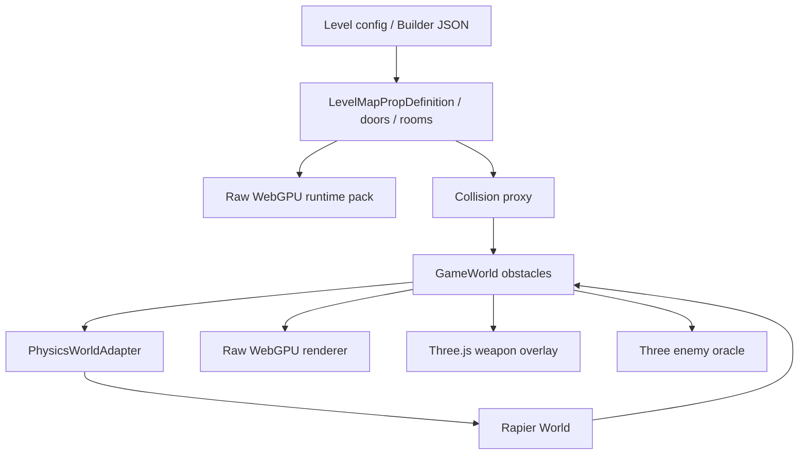

# Human Protocol 物理战斗质感升级计划书

**日期：** 2026-06-29  
**主题：** 引入 Rapier 作为核心物理层，替代当前自研 2.5D 碰撞/查询系统  
**结论：** 建议推进，但分阶段、可回滚、先静态/kinematic，后动态物件。

---

## 0. 当前实施状态（2026-06-29）

这份计划已经不只是预案，当前分支 `codex/rapier-physics-migration` 已经把 Rapier 接入为 `GameWorld` 下的 renderer-agnostic 物理服务。Raw WebGPU 仍然只读 `GameWorld`，Three.js 武器 viewmodel 也没有拥有物理状态。

| 阶段 | 当前状态 | 还剩什么 |
| --- | --- | --- |
| Phase 1-2 核心/静态 collider | 已实现。`src/game/physics` 已有 Rapier adapter、null fallback、静态 obstacle sync、yaw collider 和 debug snapshot。 | 继续保留 `?physics=legacy` 回滚路径，观察真实 QA。 |
| Phase 3 查询替换 | 已实现主路径。projectile/LOS/enemy navigation query 可走 Rapier，并保留 dual-run parity 统计。Projectile obstacle query 现在可返回 swept impact point，枪械命中墙/家具的反馈能落在首个碰撞点。 | Phase 6 的近战 capsule/box sweep 还没完整替换。 |
| Phase 4 玩家移动 | 已实现代码主路径。`PlayerMovementSystem` 先尝试 `moveKinematicCircleWithPhysics`，失败才走 legacy fallback；已有速度修正、恢复修正、dash 防穿透回归。新增 `qa:physics:browser`，在真实 Chrome + Raw WebGPU 下覆盖五个官方关卡、桌面/移动横屏、RAF/game loop、Rapier static collider 与玩家 kinematic probe；并新增窄通道 + 旋转家具连续行走、普通行走贴大型旋转家具滑行回归。浏览器 QA 现在还会临时插入宽/窄门框、玩家高位横梁、架空横梁、连续窄通道 + 旋转家具、大型旋转家具压力探针与动态 blocker，断言玩家可通过足够宽的门框和连续窄通道、可通过足够高的架空物、会被过窄门框/动态物件/对应高度障碍阻挡，顶到大型旋转家具或 opt-in 动态物件时不会跳步/爆速，并会给出受限水平轻推。系统层回归也锁住玩家 dash 撞到 opt-in 动态物件时会停止 dash 并推动小物件。 | 还要做人工手感 QA：试玩包、门框/旋转家具/窄通道逐点验收，以及移动端真机触控体感。 |
| Phase 5 怪物移动 | 已实现代码主路径。`EnemyAISystem` 的移动和 post-spacing recovery 已走 Rapier；`enemyNavigation` soft/ignore 过滤、boss/leader 高度、近墙恢复都有回归。`qa:physics:browser` 在 Level 1 含活体敌人 probe，确认浏览器 runtime 下敌人 kinematic query 可用；并新增 boss 门边 spacing pressure 连续恢复回归，锁住长期速度放大/抖动风险；系统层也覆盖 leader 级敌人沿大型旋转家具追击不会卡住、跳步或爆速。浏览器 QA 现在还会临时插入 soft/solid 导航障碍、leader 中高横梁、boss 高位/架空横梁、连续 boss 门边压力、大型旋转家具 leader 压力探针与临时动态 blocker，断言敌人过滤能越过 soft 但会被 solid、normal/leader/boss 三档高度障碍分别正确处理，连续贴门边推挤不会穿透或跳步，leader 半径顶到大型旋转家具不会跳步/爆速，且顶到 opt-in 动态物件时不会穿过去，会触发同一套受限水平轻推。 | 还要做手感调参：boss/leader 在真实关卡门边和大型家具旁的人工长时观察，尤其是高体型敌人与门/家具边缘的连续追击。 |
| Phase 6 战斗命中质感 | 已推进一段。`PhysicsWorldAdapter.castSegment` 现在返回 `position/timeOfImpact/obstacle`，Rapier shape cast 与 legacy 2D 查询都能给出首个命中点；`ProjectileSystem` 已用该命中点播放墙面/家具 `hitSpark`，避免高速枪械火花落到墙后。PulseRifle 近战现在也会对扫弧内、sweep 未被阻挡的敌人与 opt-in 动态小物件生效，动态小物件会获得水平 impulse；新增回归确认厚家具边缘会挡住挥击，低 ignore prop 不会误挡。 | 近战目标选择仍是扇形，后续可继续升级为多采样 arc/box sweep，并需要人工手感 QA。 |
| Phase 7 动态小物件 | 基础层已实现。`DynamicPropState`、Rapier dynamic body、冲击力、睡眠/寿命清理、Raw WebGPU/Three fallback 读取都已具备；并已加配置护栏，限制数量、体积、关键标签和重复动态 id。已精选 Level 1 `prop_hhup5a` 货箱堆与 Level 2 `prop_vq1oiy` 皮革软凳作为首批官方动态小物件，并用回归锁定官方动态化只允许这两个 ID。动态物件现在会响应 projectile、ultimate blast、pulseRifle 近战 impulse、player dash 与 kinematic 角色压力；projectile、近战和 blast 推动物件都已加遮挡回归，避免墙后动态物件被隔墙推动。浏览器 QA 会临时生成动态 blocker 验证真实 runtime 下玩家/敌人的移动碰撞和轻推反馈，并断言临时 blocker 清理后 `dynamicProps` 与 Rapier `dynamicBodyCount` 都恢复；还会在真实 browser runtime 下把动态物补到总上限 12、验证 overflow 被拒绝、再确认清理后 `dynamicProps` 与 Rapier `dynamicBodyCount` 回到原值。单元集成测试也锁住 dynamic prop 寿命清理后 Rapier body 会同步删除，且运行时生成动态物件不会突破 `MAX_DYNAMIC_PROPS_PER_LEVEL` 或继续膨胀 Rapier `dynamicBodyCount`；同时对 Level 1/2 动态物体施加 impulse，确认它们会移动并同步回 `GameWorld`；Level 3-5 继续断言 0 个动态体。 | 还没继续扩展到 Level 3-5 的碎片/小箱子/轻椅；后续仍应少量精选，不应批量动态化。 |
| Phase 8 默认启用与 legacy 清理 | 默认启用已完成。`PhysicsDefaults.test.ts` 已锁定无 URL 参数时默认使用 Rapier，`?physics=legacy` 仍作为紧急回滚开关。 | 重复 legacy 查询/恢复逻辑还没有删除；需要等更多人工手感 QA 后再清理。 |

因此，Phase 4/5 现在不是“不能做”，而是已经进入“主路径实现 + 回归覆盖 + 实机手感 QA”的阶段。Phase 7 也已经有基础层，但必须谨慎：先用配置护栏保证关键谜题、门、key item、大型机器不会被误标为动态物件，再逐关挑少量轻物件试做。

### 0.1 最新 QA 证据

- `npm run qa:playthrough:rapier`：五个官方关卡 headless real-playthrough 已覆盖 Rapier 主路径；Rapier 模式下每关 prime 时会验证官方动态体初始数量，通关时会验证 `dynamicProps` 与 Rapier `dynamicBodyCount` 不超过官方预期且无泄漏；同时统计玩家、敌人主移动、敌人非零位移、敌人 recovery 的 kinematic movement 调用并阻止 null/NaN 结果。有战斗击杀的关卡必须出现敌人主移动和非零敌人位移，避免只剩 post-spacing recovery 时误判 Phase 5 仍正常；Level 5 当前无战斗击杀，因此只验证玩家 kinematic 路径和动态体清理。
- `npm run qa:physics:browser`：真实 Chrome browser QA，五个官方关卡均通过 Raw WebGPU backend、browser RAF/game loop、Rapier runtime、console clean 检查；包含 Level 2 移动横屏视口，并断言 Level 1/2 各 1 个动态体、Level 3-5 为 0；同时临时插入薄 cover probe，确认 projectile sweep 的命中点落在墙面附近而不是本帧终点；还临时插入玩家宽/窄门框、玩家高位横梁、玩家可过但 boss 会撞到的架空横梁、连续窄通道 + 旋转家具、大型旋转家具玩家/leader 压力探针、敌人 soft/solid 导航障碍、leader 中高横梁、boss 高位横梁、连续 boss 门边压力和动态 blocker，确认玩家无 filter movement、连续玩家移动、normal/leader/boss 高度碰撞、敌人 filtered movement、boss 门边连续压力、大型旋转家具压力稳定性、角色高度与 Phase 7 动态物件碰撞在真实浏览器 runtime 下稳定，并验证角色顶到临时动态 blocker 时会产生可观测水平位移，且 blocker 清理后动态体数量恢复；还验证运行时动态物补到总上限 12 后 overflow 被拒绝，清理后 `dynamicProps` 与 Rapier `dynamicBodyCount` 回到探针前；并对 Level 1/2 的精选动态物件施加 impulse，确认动态体会移动、保持地面高度并同步回 `GameWorld`。
- `npm run qa:builder:browser`：已刷新到当前“烘焙并试玩 / WebGPU 试玩”单按钮 UI，并通过 /build 深度烘焙、gallery puzzle 试玩包、Raw WebGPU cooked pack、viewmodel overlay 和 compat fallback 浏览器检查。物理专项脚本不替代 builder 生产链路测试。
- `npx vitest run src/game/systems/KinematicMovementReconciliation.test.ts`：新增 Phase 4/5 边界覆盖，验证玩家窄通道 + 旋转家具连续移动、普通行走贴大型旋转家具不会卡死或跳步、玩家 dash 撞 opt-in 动态物件会停止并轻推小物件、leader 级敌人沿大型旋转家具追击不会卡住或爆速、boss 门边 spacing pressure 连续恢复都保持稳定。
- `npx vitest run src/game/systems/CombatRules.test.ts`：覆盖 pulseRifle 近战宽半径 sweep 会被厚家具边缘阻挡、低 ignore prop 不会误挡、近战推动 opt-in 动态物件，以及墙后动态物件不会被隔墙推动。
- `npx vitest run src/game/config/validation/mapValidator.test.ts` 与 `src/game/physics/DynamicPropsIntegration.test.ts`：确认 Phase 7 仍为 opt-in，小物件动态基础层可用，重复 dynamic id 会在进入 Rapier body sync 前被拒绝，运行时动态物数量不会突破配置上限或继续增加 Rapier `dynamicBodyCount`，dynamic prop 寿命清理会同步删除 Rapier body，ultimate blast 不会隔墙推动动态物件，官方五关动态化范围被限制在 Level 1 货箱堆和 Level 2 软凳两个精选 ID。

---

## 1. 一句话结论

Human Protocol 当前的战斗和移动已经有不错的手感设计，但底层碰撞仍是自研的轻量 2.5D 系统。为了提升家具碰撞准确度、子弹/近战命中一致性、怪物和玩家贴墙滑动，以及未来动态家具/碎片的物理战斗质感，建议引入 **Rapier** 作为 `src/game` 内的核心物理服务。

不要使用 `@react-three/rapier` 作为核心，因为我们的主渲染是 Raw WebGPU，武器是叠加的 Three.js viewmodel，怪物/家具也不应该依赖 Three 场景树来决定物理状态。

推荐技术路线：

- 核心包：`@dimforge/rapier3d-compat@0.19.3`
- 物理位置：`src/game/physics`
- 权威状态：继续由 `GameWorld` 持有
- 渲染关系：Raw WebGPU / Three.js 只读取 `GameWorld`，不拥有物理
- GLB 家具：继续作为视觉资产，碰撞使用配置/代理 collider，不直接用 GLB mesh

---

## 2. 为什么现在值得做

### 2.1 当前系统已经到达“够用但不够物理”的阶段

现在的系统适合早期快速开发：

- 玩家/怪物用圆形半径在 XZ 平面移动
- 墙、门、家具用 box collider
- 子弹和视线用 segment vs box
- 击退、hit stop、镜头震动、怪物分离都是手写逻辑

这套方式轻、可控、容易调参，但继续扩大关卡和家具数量后，会越来越容易出现：

- 视觉上家具转了，物理还是轴对齐盒子
- 玩家在门框、家具角、斜墙处卡住或滑动不自然
- 子弹在家具/门边缘出现奇怪挡住或穿过
- 近战打到“看起来被挡住”的敌人
- 怪物绕家具、挤墙、贴门时出现不稳定
- 想做动态碎片/可推动小物件时缺少可靠基础

### 2.2 家具已经走 WebGPU/GLB，必须把视觉和物理分清

现在的家具是 GLB + Raw WebGPU runtime pack 渲染。正确的物理策略不是“拿 GLB mesh 当碰撞”，而是：

- GLB 负责视觉质量
- 配置里的 `collider` / proxy 负责物理形状
- Rapier 负责碰撞、查询、移动修正
- `GameWorld` 负责把结果同步给渲染

这和现有架构是相容的，因为项目已经有：

- `LevelMapPropDefinition.position`
- `LevelMapPropDefinition.rotation`
- `LevelMapPropDefinition.scale`
- `LevelMapPropDefinition.collider`
- `resolvePropCollisionProxy`
- `world.obstacles`
- Raw WebGPU instance transform

也就是说，项目不是从零接物理，而是把已有的“碰撞代理”升级成真正物理层。

---

## 3. 目标

### 3.1 第一目标

提升战斗和移动中的物理可信度：

- 家具碰撞更贴近视觉
- 子弹/近战命中更稳定
- 玩家贴墙、过门、贴家具移动更顺
- 怪物绕障碍和挤压更可控
- 门开关、房间墙、家具 collider 在一个统一物理世界中查询

### 3.2 第二目标

为后续高质感战斗铺路：

- 小箱子被击退
- 轻家具被爆炸推开
- 玻璃/碎片飞散
- Boss 攻击造成环境反应
- 武器击中不同材质产生不同反馈

### 3.3 非目标

第一阶段不做这些：

- 不把玩家/怪物改成完全动态刚体
- 不让 Three.js 场景拥有物理
- 不让 Raw WebGPU 直接参与物理计算
- 不用每个 GLB mesh 自动生成碰撞
- 不重写战斗伤害、升级、波次、剧情逻辑
- 不一次性移除旧碰撞系统

---

## 4. 推荐方案

### 4.1 方案选择

| 方案 | 结论 | 原因 |
| --- | --- | --- |
| 继续自研碰撞 | 不推荐长期继续 | 成本会越来越高，查询/滑墙/动态物件都要自己补 |
| `@react-three/rapier` | 不推荐做核心 | 绑定 React/R3F，项目主渲染是 Raw WebGPU，且当前 React/R3F 版本不匹配最新版 |
| Cannon-es | 不推荐 | 轻量但长期活跃度和能力不如 Rapier |
| JoltPhysics.js | 暂不推荐第一步 | 强但重，适合未来复杂动态刚体、ragdoll、破坏系统 |
| Babylon Havok | 暂不推荐 | 更贴 Babylon 生态，会引入额外架构边界 |
| Rapier 底层包 | 推荐 | 独立于渲染、功能够强、适合 kinematic 角色、ray/shape query、动态刚体 |

### 4.2 最终推荐

使用：

```text
@dimforge/rapier3d-compat@0.19.3
```

放在：

```text
src/game/physics
```

通过 adapter 隔离：

```text
GameWorld / Systems
        |
PhysicsWorldAdapter
        |
RapierPhysicsWorldAdapter
```

这样即使 Rapier 出问题，也可以切回 legacy path。

---

## 5. 架构设计

### 5.1 数据流



### 5.2 核心原则

1. **GameWorld 是唯一权威状态**

   物理结果写回 `GameWorld`。Raw WebGPU 和 Three.js 都只读取它。

2. **GLB 是视觉，不是碰撞**

   家具碰撞走 `collider` / proxy。复杂家具使用多个 box 组合，极少数静态大件才考虑 trimesh/convex。

3. **先 kinematic，后 dynamic**

   玩家和怪物先用 kinematic capsule。不要一开始改成动态刚体，否则战斗手感会失控。

4. **先并行验证，再替换**

   旧系统和 Rapier 先 dual-run，对比结果。稳定后逐步切换默认路径。

---

## 6. 分阶段计划

### Phase 0：基线测量与风险锁定

**目标：** 先知道当前系统的问题和指标，避免“改完感觉变了但说不清好坏”。

工作内容：

- 记录 Level 1/2/3 当前移动、碰撞、战斗体感问题
- 加入旋转家具 collider 的测试用例
- 记录当前性能：平均帧时间、敌人数、投射物数量、obstacle 数量
- 定义 `?physics=legacy` 和未来 `?physics=rapier` 的 QA 路线

产出：

- 当前问题清单
- 基线测试
- 性能基线

预估耗时：

- 0.5-1 天

风险：

- 低

### Phase 1：引入 Rapier，但不改变玩法

**目标：** 安装 Rapier，创建 adapter，默认不启用。

工作内容：

- 添加 `@dimforge/rapier3d-compat`
- 新建 `src/game/physics`
- 创建 `PhysicsWorldAdapter`
- 创建 `NullPhysicsWorldAdapter`
- 创建 `RapierPhysicsWorldAdapter`
- 增加初始化 smoke test

产出：

- Rapier 能初始化
- 能创建 fixed collider、kinematic capsule
- 默认玩法仍然走 legacy

预估耗时：

- 1 天

风险：

- 低

### Phase 2：同步静态 collider

**目标：** 把墙、门、家具 collider 映射到 Rapier。

工作内容：

- 修正家具 proxy 保留 yaw
- 把 `world.obstacles` 转成 Rapier fixed cuboid collider
- 门开关时同步启用/移除 collider
- 支持 `enemyNavigation: solid / soft / ignore`
- 保留旧 `world.obstacles` 作为兼容层

产出：

- Rapier 里有和当前关卡一致的静态碰撞世界
- 旋转家具物理形状和视觉更一致

预估耗时：

- 1-2 天

风险：

- 中低

### Phase 3：先替换查询，不替换移动

**目标：** 子弹、视线、近战阻挡先用 Rapier query。

工作内容：

- 用 raycast / shape cast 替换 projectile obstacle query
- 用 raycast 替换 line of sight
- 近战可选用 shape cast 检查被家具/墙阻挡
- 开启 dual-run，对比 legacy 和 Rapier 查询结果

产出：

- 子弹和视线更稳定
- 家具/门边缘的误挡、漏挡减少

预估耗时：

- 1-2 天

风险：

- 中

### Phase 4：替换玩家移动

**目标：** 玩家移动、冲刺、贴墙滑动改为 Rapier kinematic。

工作内容：

- 玩家 capsule 由 `playerConfig.radius` 和角色高度推导
- 保留当前速度、冲刺、能量、输入逻辑
- 只替换最终位置修正
- 加入门框、斜墙、旋转家具、dash 防穿透测试

产出：

- 玩家贴墙更顺
- 家具碰撞更可信
- 门框卡顿减少

预估耗时：

- 2-3 天

风险：

- 中高，因为玩家手感非常敏感

### Phase 5：替换怪物移动

**目标：** 怪物最终碰撞修正改为 Rapier，AI 逻辑不重写。

工作内容：

- 保留当前追踪、绕障碍、攻击范围、分离逻辑
- 用 Rapier 做最终移动修正
- 保持 `enemyNavigation` 语义
- 特别测试 boss/leader/小怪在家具和门边的表现

产出：

- 怪物更少卡进家具
- 怪物贴墙/贴门 jitter 减少
- 战斗空间更可信

预估耗时：

- 2-4 天

风险：

- 中高

### Phase 6：提升战斗命中质感

**目标：** 让武器命中更像真实体积，而不是纯数学扇形/点线。

工作内容：

- 近战从扇形判定逐步加入 capsule/box sweep
- 枪械投射物用 shape cast 而非单点终点
- 保留当前伤害、hit stop、镜头冲击、音效
- 不改升级系统和武器数值

产出：

- 近战穿墙命中减少
- 枪械边缘命中更稳定
- 打击可信度提升

预估耗时：

- 1-3 天

风险：

- 中

### Phase 7：小规模动态家具/碎片

**目标：** 真正拉开“物理战斗质感”的体感差距。

工作内容：

- 只选少量可动态的轻物件
- 新建 `DynamicPropState`
- Rapier 计算动态物件 transform
- Raw WebGPU 支持动态 prop transform override
- 手机限制动态数量和休眠

建议对象：

- 小箱子
- 桶
- 轻椅子
- 碎片板
- 可破坏玻璃/展柜碎片

不建议对象：

- 关键谜题物体
- 门
- 大型机器
- 任务关键 key item
- 堵路核心家具

产出：

- 爆炸/击退能推动小物件
- 战斗更有重量感
- 房间更有反应

预估耗时：

- 3-6 天

风险：

- 高，尤其是性能和关卡可解性

### Phase 8：默认启用与旧系统清理

**目标：** Rapier 稳定后默认启用，旧系统只保留必要 fallback。

工作内容：

- 默认 `physics=rapier`（已完成）
- 保留 `?physics=legacy` 一段时间（已完成，作为紧急回滚开关）
- 删除已完全替代的重复查询逻辑
- 更新 QA 文档和性能预算

产出：

- 新物理系统成为主路径
- 旧逻辑减少维护成本

预估耗时：

- 1-2 天

风险：

- 中

---

## 7. 预期提升

### 7.1 分阶段体感提升

| 范围 | 预期体感提升 | 可信度 |
| --- | ---: | --- |
| 只修正家具/门/墙 collider 和查询 | 10-25% | 高 |
| 加上玩家 kinematic 移动 | 20-35% | 中高 |
| 加上怪物 kinematic 移动 | 25-40% | 中 |
| 加上少量动态家具/碎片 | 35-60% | 中 |

### 7.2 具体改善项

| 问题 | 当前情况 | 引入 Rapier 后 |
| --- | --- | --- |
| 旋转家具碰撞 | 可能视觉旋转、物理不准 | collider 可跟随 yaw |
| 门框卡顿 | 手写 push-out 容易不稳定 | kinematic correction 更自然 |
| 子弹边缘阻挡 | segment vs box 容易误判 | ray/shape query 更稳定 |
| 近战穿墙 | 扇形判定容易穿厚障碍 | sweep/query 可检查遮挡 |
| 怪物挤家具 | 自研分离和 push-out 容易 jitter | Rapier 最终修正更可靠 |
| 动态小物件 | 当前基本没有 | 可逐步加入真实推动/击飞 |

### 7.3 最现实的收益判断

如果只做 Phase 1-5：

```text
整体战斗/移动可信度提升：约 20-40%
```

如果继续做 Phase 7 动态小物件：

```text
战斗物理体感提升：约 35-60%
```

但注意：动态小物件不是第一阶段收益，它需要 Raw WebGPU transform 同步、性能限制、关卡安全规则一起做。

---

## 8. 成本与风险

### 8.1 性能成本

预期成本：

| 平台 | 预期 CPU 成本 |
| --- | ---: |
| 桌面 | +0.2 到 +1.5ms/frame |
| 手机 | +0.6 到 +3.0ms/frame |

包体：

- `@dimforge/rapier3d-compat@0.19.3` unpacked 约 8.2MB
- 实际 gzip/brotli 后需要 Vite build 测量

### 8.2 风险列表

| 风险 | 严重度 | 应对 |
| --- | --- | --- |
| 玩家手感变化 | 高 | feature flag + legacy fallback + 分阶段调参 |
| 怪物卡顿/抖动 | 中高 | 先保留 AI，只替换最终碰撞修正 |
| 手机性能下降 | 中高 | 限制 dynamic body，先做静态/kinematic |
| 关卡进度被动态物件堵住 | 高 | 第一阶段不让关键物体 dynamic |
| WebGPU 视觉和物理不同步 | 中 | `GameWorld` 统一 transform，渲染只读 |
| 包初始化失败 | 中 | `NullPhysicsWorldAdapter` fallback |
| 和现有 QA 脚本不一致 | 中 | dual-run parity 和 smoke:campaign |

---

## 9. 验收标准

### 9.1 功能验收

- 玩家不能穿墙、穿门、穿家具
- 旋转家具的视觉和物理轮廓明显更一致
- 子弹不会穿过关闭的门和厚家具
- 近战不会明显穿厚墙/厚家具击中敌人
- 怪物不会明显卡进家具或门
- Level 1/2 官方 builder-native 流程不被破坏
- Level 3 museum exception 不被破坏
- Raw WebGPU 和 Three fallback 都能运行

### 9.2 性能验收

- 桌面平均帧时间不明显恶化
- 手机不因物理导致持续掉帧
- 动态刚体数量有硬上限
- 物理 step 时间有 debug 统计

### 9.3 QA 命令

实施阶段需要跑：

```bash
npx vitest run src/game/physics/RapierPhysicsWorldAdapter.test.ts
npx vitest run src/game/physics/PhysicsParity.test.ts src/game/systems/CombatRules.test.ts
npm run smoke:campaign
npm run qa:build-official -- --level=level_01_maintenance_bay
npm run qa:build-official -- --level=level_02_residential_simulation
npm run build
git diff --check
```

浏览器 QA：

```text
http://127.0.0.1:5173/?debug=0&level=level_01_maintenance_bay&lang=zh&physics=rapier
http://127.0.0.1:5173/?debug=0&level=level_02_residential_simulation&lang=zh&physics=rapier
http://127.0.0.1:5173/?debug=0&level=level_03_human_museum&lang=zh&physics=rapier
http://127.0.0.1:5173/?debug=0&level=level_01_maintenance_bay&lang=zh&compat=1&physics=rapier
```

---

## 10. 排期建议

### 保守版

| 阶段 | 时间 |
| --- | ---: |
| Phase 0-1 | 1-2 天 |
| Phase 2-3 | 2-4 天 |
| Phase 4 | 2-3 天 |
| Phase 5 | 2-4 天 |
| QA/调参 | 2-4 天 |
| 合计 | 9-17 天 |

### 快速验证版

如果只想先确认 Rapier 是否值得：

| 内容 | 时间 |
| --- | ---: |
| Rapier adapter |
| 静态 collider sync |
| projectile/LOS query |
| 旋转家具测试 |
| 简单浏览器 QA |
| 合计 3-5 天 |

快速验证版不替换玩家/怪物移动，只验证最确定的收益点。

---

## 11. 推荐执行顺序

建议先做一个小闭环：

1. 加 Rapier adapter
2. 同步静态墙/门/家具 collider
3. 修正旋转家具 yaw
4. 用 Rapier 替换 projectile/LOS query
5. 在 Level 1/2/3 做浏览器 QA

这个闭环能验证：

- 包是否适合项目
- WebGPU/Three 混合架构是否稳定
- 家具 collider 是否明显变准
- 子弹/视线是否更可信
- 性能成本是否可接受

如果这个闭环效果好，再进入玩家/怪物 movement。  
如果闭环效果一般，也可以只保留 yaw 修正和查询改进，不急着全面替换。

---

## 12. 最终建议

建议推进，但不要一次性“大换血”。

最优策略是：

```text
先做 Rapier 核心服务 + 静态 collider + 查询替换，
再做玩家 kinematic，
再做怪物 kinematic，
最后才做动态家具/碎片。
```

这条路线的好处是：

- 风险可控
- 每一步都能单独验收
- 可以随时回滚到 legacy
- 不破坏 Raw WebGPU / Three.js 的分工
- 能先拿到最确定的收益
- 后续有空间做更强的物理战斗质感

最终判断：

```text
Rapier 值得引入。
第一阶段预期提升 20-40% 的物理可信度和战斗稳定性。
加入动态家具后，物理战斗体感有机会提升到 35-60%。
```
