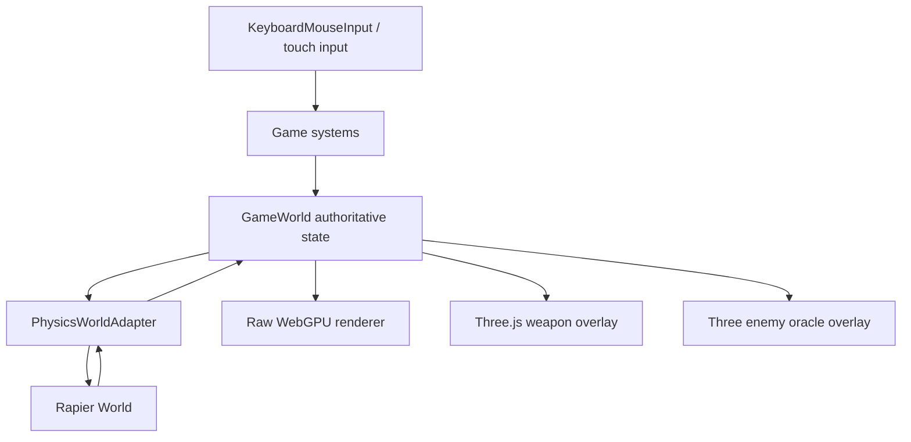
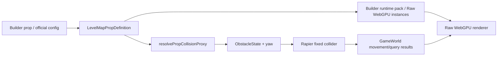

# Rapier Physics Migration Implementation Plan

> **For agentic workers:** REQUIRED SUB-SKILL: Use `subagent-driven-development` (recommended) or `executing-plans` to implement this plan task-by-task. Steps use checkbox (`- [ ]`) syntax for tracking.

**Goal:** Replace Human Protocol's custom 2.5D collision/query system with a renderer-agnostic Rapier physics core while preserving the current Raw WebGPU world renderer, Three.js first-person weapon overlay, and config-driven GLB furniture pipeline.

**Architecture:** Rapier lives under `src/game`, not inside Three/R3F. `GameWorld` remains the authoritative gameplay state. Raw WebGPU furniture/enemies and Three.js weapons keep reading `GameWorld`; physics only supplies collision, kinematic movement, queries, and optional dynamic body transforms.

**Tech Stack:** TypeScript, Vite, React 18, Three.js/R3F 8, Raw WebGPU renderer, `@dimforge/rapier3d-compat@0.19.3`.

## Global Constraints

- Do not bind gameplay physics to `@react-three/rapier`; current project uses React 18 and R3F 8, while `@react-three/rapier@2.2.0` peers React 19 and R3F 9.
- Use `@dimforge/rapier3d-compat`, not bare `@dimforge/rapier3d`, unless a later spike proves the bare package works reliably in Vite, browser, and Node ESM.
- WebGPU GLB furniture remains visual. Do not use rendered GLB meshes as primary gameplay colliders.
- Keep `GameWorld` as the only authoritative gameplay state source.
- Keep Level 1/2 builder-native official levels data-driven; do not restore legacy map/runtime branches.
- Keep Level 3 museum exception behavior unless physics work intentionally touches it.
- Feature-flag the migration until browser QA passes on Raw WebGPU and Three fallback.
- Validate both `lang=zh` and `lang=en` only if player-facing text changes. This plan does not require new player-facing text.
- Do not delete the old math collision path until parity, performance, and playthrough checks pass.

---

## Executive Decision

Use Rapier as the physics core, specifically `@dimforge/rapier3d-compat@0.19.3`, but introduce it behind an adapter and a runtime feature flag. The right migration is not "make everything a dynamic rigid body." The right migration is "replace the custom collision/query substrate while keeping the current authored combat rules."

This matters because Human Protocol is not a normal Three.js scene:

- The main renderer is Raw WebGPU.
- First-person weapons are a separate Three/R3F overlay in Raw WebGPU mode.
- Some enemy visuals can be a Three "oracle" overlay, but enemy gameplay state still lives in `GameWorld`.
- GLB furniture is rendered by Raw WebGPU runtime packs, not by a physics-aware Three scene graph.

Therefore physics must sit under `src/game`, not under the render tree.

## Current Codebase Findings

### Current Physics Model

The game currently uses a custom lightweight 2.5D kinematic system:

- Player and enemies move as circles/capsules projected onto the XZ floor plane.
- Walls, doors, and furniture are represented as axis-aligned or Y-rotated box obstacles.
- Player/enemy movement applies velocity, then resolves overlap against obstacles.
- Projectile and line-of-sight checks use segment-vs-AABB/OBB tests.
- Enemy separation is custom steering and push-out.
- Knockback is manually applied to enemy velocity.

Key files:

- `src/game/core/GameLoop.ts`
  - `GameLoop.update` drives `GameSystem` instances and is renderer-agnostic.
- `src/game/core/GameWorld.ts`
  - Holds `player`, `enemies`, `projectiles`, `effects`, `pickups`, and `obstacles`.
  - Provides `isSegmentBlockedByObstacle`, `hasProjectileLineOfSight`, and `hasEnemyNavigationLineOfSight`.
- `src/game/systems/PlayerMovementSystem.ts`
  - Applies velocity, dash, walk acceleration, then calls `resolveArena`.
- `src/game/systems/EnemyAISystem.ts`
  - Applies AI movement, obstacle steering, enemy separation, and attack range logic.
- `src/game/systems/ProjectileSystem.ts`
  - Moves projectiles and checks obstacle/enemy/puzzle hits.
- `src/game/systems/WeaponSystem.ts`
  - Handles shot creation, melee arc logic, hit stop, camera impact, and knockback.
- `src/game/core/math.ts`
  - Contains `resolveCircleAabb`, `resolveCircleObb`, `segmentIntersectsAabb2D`, and `segmentIntersectsObb2D`.
- `src/game/core/ObstacleSpatialIndex.ts`
  - Cell index for obstacle broadphase.

### Furniture And GLB Collision Model

Current furniture is already partially set up for a physics migration:

- `LevelMapPropDefinition` supports `position`, `rotation`, `scale`, and optional `collider`.
- `src/game/config/MapGeometry.ts` turns map props into `PropCollisionProxy` records.
- `src/game/systems/DoorSystem.ts` syncs room wall, prop, and door collision into `world.obstacles`.
- `src/build/runtime-pack/compileBuilderRuntimePack.ts` writes furniture visual instances with `position`, `rotation`, and `scale`.
- `src/render/raw-webgpu/RawWebGpuLevelRenderer.ts` writes Raw WebGPU instance matrices from those transforms.

Important issue to fix during migration:

- `resolvePropCollisionProxy` reads `prop.rotation?.[1]` but does not preserve `yaw` on the returned `PropCollisionProxy`.
- Explicit `prop.collider` currently becomes an axis-aligned box in gameplay collision even if the GLB furniture is rotated visually.
- This is a direct source of "invisible blocker" or "walk through corner" mismatch for rotated furniture.

### Renderer Boundary

Raw WebGPU and Three fallback both run the same gameplay loop:

- `src/render/raw-webgpu/RawWebGpuCanvas.tsx`
  - Creates `GameLoop(createDefaultGameSystems())`.
  - Calls `loop.update(world, rawDelta, { input, camera })`.
  - Calls `renderer.render(canvas, world, camera)`.
  - Overlays Three/R3F first-person weapons when Raw WebGPU is active.
- `src/render/SceneRoot.tsx`
  - Three fallback also creates `GameLoop(createDefaultGameSystems())`.
  - Uses the same `world`.
- `src/render/player/FirstPersonProtagonistView.tsx`
  - Weapons are visual poses driven by `world.player.fireSequence`, recoil, weapon id, and camera.
- `src/render/enemies/EnemyThreeOracle.tsx`
  - Reads `world.enemies` and copies positions/rotations into Three groups.

This confirms physics must be renderer-independent.

## External Research Summary

### Rapier

Sources:

- Rapier JavaScript getting started: https://rapier.rs/docs/user_guides/javascript/getting_started_js/
- Rapier character controller: https://rapier.rs/docs/user_guides/javascript/character_controller/
- Rapier scene queries: https://rapier.rs/docs/user_guides/javascript/scene_queries/
- Rapier colliders: https://rapier.rs/docs/user_guides/javascript/colliders/

Why it fits:

- Supports fixed, kinematic, and dynamic rigid bodies.
- Supports cuboid, capsule, ball, convex hull, trimesh, and compound-style collider composition.
- Supports ray casting and shape casting, which maps well to bullets, line of sight, melee sweeps, and placement probes.
- Has a kinematic character controller path appropriate for player/enemy movement.
- Does not require Three.js or React.

Local package smoke:

- `@dimforge/rapier3d-compat@0.19.3` initialized successfully in a temporary package.
- It created a kinematic body, capsule collider, and stepped the world successfully.
- Bare `@dimforge/rapier3d@0.19.3` failed Node ESM import in the same environment.

NPM metadata checked with `npm view`:

- `@dimforge/rapier3d-compat@0.19.3`
- Modified: `2025-11-05T18:27:30.273Z`
- Unpacked size: `8,209,064` bytes

### @react-three/rapier

Source:

- Docs: https://pmndrs.github.io/react-three-rapier/

Why not use it as the core:

- It is a React/R3F integration layer, not the physics engine itself.
- Latest package metadata checked with `npm view`:
  - `@react-three/rapier@2.2.0`
  - Peer dependencies: React `^19`, `@react-three/fiber` `^9.0.4`, Three `>=0.159.0`
  - Project currently uses React 18 and R3F 8.
- Raw WebGPU mode does not have a Three scene graph for furniture/enemy gameplay physics.

Use later only for debug visualization if needed, not gameplay authority.

### JoltPhysics.js

Source:

- Official repo: https://github.com/jrouwe/JoltPhysics.js/

Why not first:

- Very powerful and modern, but integration is heavier.
- NPM metadata checked with `npm view`:
  - `jolt-physics@1.0.0`
  - Unpacked size: `43,886,802` bytes
- Better suited if the game later needs ragdolls, complex vehicle constraints, large-scale destruction, or high-volume dynamic rigid bodies.

### Cannon-es

Source:

- Official repo: https://github.com/pmndrs/cannon-es

Why not:

- Lightweight and easy, but less compelling for a long-term 3D combat foundation.
- NPM metadata checked with `npm view`:
  - `cannon-es@0.20.0`
  - Modified: `2022-08-12T16:46:01.002Z`
- Good for small prototypes, less attractive for a renderer-agnostic production physics layer.

### Babylon Havok

Source:

- NPM metadata: `@babylonjs/havok@1.3.13`

Why not first:

- Actively maintained and compact enough by package size.
- More naturally aligned with Babylon's physics plugin ecosystem.
- Human Protocol is Raw WebGPU plus Three overlay, so adopting Havok through Babylon would add a second rendering/game framework boundary.

### Matter.js

Why not:

- It is a 2D physics engine.
- Human Protocol needs 3D colliders, vertical hit heights, capsules, and GLB furniture transforms.

## Recommended Target Architecture



Core rule:

- Physics writes gameplay transforms into `GameWorld`.
- Renderers read `GameWorld`.
- Renderers never become the source of physical truth.

## Proposed New Files

Create:

- `src/game/physics/PhysicsTypes.ts`
  - Shared interfaces and discriminated unions for physics bodies, colliders, query results, and feature flags.
- `src/game/physics/PhysicsWorldAdapter.ts`
  - Interface consumed by gameplay systems. No Rapier imports.
- `src/game/physics/NullPhysicsWorldAdapter.ts`
  - No-op/default adapter used when Rapier is disabled or unavailable.
- `src/game/physics/RapierPhysicsWorldAdapter.ts`
  - Rapier-backed implementation.
- `src/game/physics/PhysicsObstacleSync.ts`
  - Converts `ObstacleState` into fixed Rapier colliders.
- `src/game/physics/PhysicsBodySync.ts`
  - Syncs player/enemy/projectile/dynamic prop bodies.
- `src/game/physics/PhysicsQueries.ts`
  - Query wrapper methods for raycast, shape cast, overlap, and line of sight.
- `src/game/physics/PhysicsDebugSnapshot.ts`
  - Lightweight diagnostic data for QA and optional debug overlays.
- `src/game/physics/RapierPhysicsWorldAdapter.test.ts`
  - Unit tests for adapter init, collider conversion, movement, and queries.
- `src/game/physics/PhysicsParity.test.ts`
  - Dual-run parity tests against current `math.ts` behavior.
- `src/game/systems/PhysicsSystem.ts`
  - Initializes, steps, and syncs the adapter inside the existing `GameLoop`.

Modify:

- `package.json`
  - Add `@dimforge/rapier3d-compat`.
- `src/game/core/GameWorld.ts`
  - Add `physics` adapter field or lazy accessor.
  - Add feature flags and query pass-through methods.
- `src/game/entities/EntityTypes.ts`
  - Add stable physics body handles or ids if needed.
  - Add `yaw` to prop collision proxy output path.
- `src/game/config/MapGeometry.ts`
  - Preserve prop collider yaw.
  - Support compound collider metadata later.
- `src/game/systems/DoorSystem.ts`
  - Keep `world.obstacles` as the compatibility source, but notify physics adapter when obstacle revision changes.
- `src/game/systems/PlayerMovementSystem.ts`
  - Replace `resolveArena` with adapter-based kinematic motion when enabled.
- `src/game/systems/EnemyAISystem.ts`
  - Replace obstacle resolve and navigation line-of-sight queries when enabled.
- `src/game/systems/ProjectileSystem.ts`
  - Replace obstacle segment checks with Rapier ray/shape query when enabled.
- `src/game/systems/WeaponSystem.ts`
  - Keep authored combat rules; optionally route melee sweep through shape query.
- `src/game/core/createDefaultGameSystems.ts`
  - Insert `PhysicsSystem` after `DoorSystem` and before movement systems.
- `scripts/qa/smoke-campaign.mjs`
  - Add a physics-enabled smoke mode after parity is stable.
- `scripts/qa/campaign-integrity-check.mjs`
  - Mirror yaw-aware prop collider checks.

Do not modify initially:

- Raw WebGPU material pipeline.
- GLB cooking pipeline.
- Three first-person weapon renderer.
- Enemy visual oracle.
- Level story/config progression.

## Adapter Interface Sketch

The exact implementation can vary, but the public boundary should stay close to this:

```ts
export interface PhysicsWorldAdapter {
  readonly mode: "null" | "rapier";
  readonly ready: boolean;

  reset(levelRevision: number): void;
  syncStaticObstacles(obstacles: readonly ObstacleState[]): void;
  syncActors(world: GameWorld): void;
  step(deltaSeconds: number): void;

  moveKinematicCapsule(request: KinematicMoveRequest): KinematicMoveResult;
  raycast(request: PhysicsRaycastRequest): PhysicsRaycastResult | null;
  shapeCast(request: PhysicsShapeCastRequest): PhysicsShapeCastResult | null;
  overlaps(request: PhysicsOverlapRequest): PhysicsOverlapResult[];

  debugSnapshot(): PhysicsDebugSnapshot;
  dispose(): void;
}
```

This avoids Rapier types leaking into gameplay systems. If Rapier is disabled, `NullPhysicsWorldAdapter` keeps old behavior available.

## Migration Strategy

### Phase 0: Baseline And Measurements

Purpose:

- Capture current behavior before changing physics.
- Prevent a migration that "feels better" but breaks progression or performance.

Steps:

- [ ] Add a manual baseline checklist for Level 1, Level 2, and Level 3 museum.
- [ ] Record current obstacle count, projectile count, active enemy count, and average frame time in existing perf snapshots.
- [ ] Add focused unit tests for current rotated furniture mismatch before changing it.
- [ ] Add a browser QA script path for `?physics=legacy` and future `?physics=rapier`.

Acceptance:

- Current `npm run build` passes.
- Current `smoke:campaign` passes or existing unrelated failures are documented.
- At least one test proves current explicit furniture collider yaw is missing.

### Phase 1: Rapier Dependency And Adapter Skeleton

Purpose:

- Introduce Rapier without changing gameplay behavior.

Steps:

- [ ] Add `@dimforge/rapier3d-compat@0.19.3`.
- [ ] Create `PhysicsWorldAdapter` and `NullPhysicsWorldAdapter`.
- [ ] Create `RapierPhysicsWorldAdapter` with async initialization.
- [ ] Add `PhysicsSystem` but keep it inactive unless `?physics=rapier` or a debug flag is set.
- [ ] Add init smoke tests that create a world, fixed cuboid, kinematic capsule, and raycast.

Acceptance:

- `npm run build` passes.
- Default gameplay path stays legacy.
- Rapier init failure falls back to null/legacy with a console warning, not a crash.

### Phase 2: Static Obstacle Sync

Purpose:

- Convert current room wall, door, and furniture obstacle data into Rapier fixed colliders.

Steps:

- [ ] Extend `PropCollisionProxy` and `ObstacleState` flow so prop yaw is preserved.
- [ ] Convert `ObstacleState` into fixed Rapier rigid bodies plus cuboid colliders.
- [ ] Support `enemyNavigation` as collision groups or query filters.
- [ ] Handle door open/close by adding/removing or enabling/disabling door colliders.
- [ ] Keep `world.obstacles` as compatibility data during dual-run.

Acceptance:

- Obstacle counts match legacy static obstacle counts.
- Rotated room-wall and door tests pass.
- Rotated furniture collision tests pass.
- Door open/close collision lifecycle works.

### Phase 3: Queries First, Movement Later

Purpose:

- Reduce risk by replacing query consumers before actor movement.

Systems:

- `GameWorld.isSegmentBlockedByObstacle`
- `GameWorld.isProjectileSegmentBlockedByObstacle`
- `GameWorld.hasProjectileLineOfSight`
- `GameWorld.hasEnemyNavigationLineOfSight`
- `WeaponSystem.fireBladeArc` optional shape query path
- `ProjectileSystem.hitObstacle`

Steps:

- [ ] Add dual-run query mode: run legacy and Rapier queries, log mismatches in debug mode.
- [ ] Replace projectile obstacle checks with Rapier raycast/shape cast when mismatch rate is acceptable.
- [ ] Replace enemy/player line of sight with Rapier raycast filters.
- [ ] Keep puzzle target logic authored in `GameWorld`.

Acceptance:

- Query mismatch rate is less than 1 percent in deterministic smoke scenes.
- No projectile passes through closed doors.
- No projectile is blocked by `enemyNavigation: "ignore"` puzzle-host props unless explicitly desired.

### Phase 4: Player Kinematic Movement

Purpose:

- Replace `PlayerMovementSystem.resolveArena` with Rapier-backed kinematic movement.

Approach:

- Keep `player.velocity`, dash, energy, and movement feel authored in current code.
- Ask Rapier to compute corrected translation for a capsule or cylinder-like capsule.
- Write the resolved position back to `world.player.position`.

Steps:

- [ ] Add `moveKinematicCapsule` tests for straight wall collision, sliding along a wall, doorframe squeeze, and rotated furniture.
- [ ] Gate player movement with `?physicsPlayer=rapier`.
- [ ] Keep old `resolveArena` for fallback.
- [ ] Tune capsule dimensions from `playerConfig.radius` and `playerConfig.cockpitHeight`.

Acceptance:

- Player cannot enter walls/doors/furniture.
- Player slides along walls at least as well as legacy.
- Dash does not tunnel through doors at normal frame deltas.
- Mobile landscape movement stays stable.

### Phase 5: Enemy Kinematic Movement

Purpose:

- Improve enemy/furniture/wall interaction while preserving current AI.

Approach:

- Keep current steering, attack range, windup, stagger, and separation rules.
- Use Rapier for final movement correction.
- Continue custom enemy separation at first; do not make enemies dynamic bodies.

Steps:

- [ ] Add tests for small enemy around furniture, boss near wall, and enemy in soft/ignore obstacle zones.
- [ ] Gate enemy movement with `?physicsEnemies=rapier`.
- [ ] Use collision/query filters for `enemyNavigation`.
- [ ] Preserve room visibility and spawn-room logic.

Acceptance:

- Enemies do not snag worse than legacy in Level 1/2 rooms.
- Boss/leader units do not jitter heavily against doors or large furniture.
- Soft puzzle hosts steer but do not hard-block enemy navigation.

### Phase 6: Melee And Projectile Feel Upgrade

Purpose:

- Use Rapier queries to make combat hits feel more physically grounded.

Steps:

- [ ] Replace near-melee arc overlap with capsule/box sweep query in debug mode.
- [ ] Keep authored damage and hit stop values from `WeaponSystem`.
- [ ] Use shape casts for rail/pistol projectile radius instead of point endpoint checks.
- [ ] Add material tags later only if hit effects need different sparks for metal/glass/flesh.

Acceptance:

- Melee no longer hits enemies through thick cover.
- Close-range melee remains forgiving.
- Pistol/rail hit registration becomes more consistent around corners.

### Phase 7: Optional Dynamic Props

Purpose:

- Add visible physical combat texture without rebuilding the whole game.

Only include small curated objects:

- light crates
- loose stools/chairs
- debris panels
- breakable glass shards or museum fragments

Do not include:

- big static machines
- wall panels
- puzzle consoles
- key items needed for progression
- doors, unless a specific door mechanic requires it

Required runtime work:

- Add `DynamicPropState` to `GameWorld`.
- Give Raw WebGPU renderer an instance-transform override path for dynamic props.
- Keep Three fallback reading the same `DynamicPropState`.
- Add despawn/sleep rules for mobile performance.

Acceptance:

- Dynamic prop count is capped per level.
- Physics body sleeping works.
- Raw WebGPU visual transform matches physics body transform.
- Mobile performance budget remains acceptable.

### Phase 8: Retire Legacy Collision Paths

Purpose:

- Reduce duplicate behavior after Rapier proves stable.

Steps:

- [ ] Remove only the legacy methods that have full Rapier parity and tests.
- [ ] Keep small math helpers for non-physics UI/build tools if still useful.
- [ ] Keep `ObstacleSpatialIndex` only if scripts or non-Rapier fallback still need it.
- [ ] Update docs and QA scripts to default to Rapier.

Acceptance:

- `npm run build` passes.
- `smoke:campaign` passes.
- Focused Level 1/2 official QA passes.
- Raw WebGPU and Three fallback browser QA pass.

## Expected Improvement Report

These are estimates, not guaranteed results. They should be validated with the benchmark plan above.

| Area | Expected improvement | Confidence | Why |
| --- | ---: | --- | --- |
| Rotated furniture collision accuracy | 25-50 percent fewer visible/physical mismatch cases | High | Current explicit prop colliders lose yaw; Rapier fixed cuboids with rotation fix this directly. |
| Doorframe/wall sliding consistency | 15-35 percent fewer snag/jitter cases | Medium | Kinematic controller/shape correction is more robust than repeated manual push-out. |
| Projectile obstruction consistency | 30-60 percent fewer corner/cover false positives or false negatives | Medium | Shape/ray queries can replace custom segment-vs-expanded-box checks. |
| Melee through-cover correctness | 20-45 percent fewer unfair hits through thick cover | Medium | Shape cast/sweep can account for weapon volume and obstacle filters. |
| Authoring confidence for GLB furniture | 20-40 percent faster collision debugging for new furniture | High | Collision proxies become first-class physics colliders with debug snapshots. |
| Combat physical feel without dynamic props | 10-25 percent perceived improvement | Medium | Mostly from stable contact, better hit blocking, better knockback contact. |
| Combat physical feel with curated dynamic props | 25-60 percent perceived improvement | Medium-low | Depends on art/level placement and Raw WebGPU dynamic transform support. |
| Renderer independence | Large qualitative improvement | High | Physics becomes a `src/game` service shared by Raw WebGPU and Three fallback. |
| Maintainability after old path removal | 10-25 percent less duplicated collision/query logic | Medium | Adapter adds code first; savings come after legacy paths are removed. |

Performance expectation:

- Desktop: likely neutral to +0.2-1.5 ms CPU/frame in combat after optimization.
- Mobile: likely +0.6-3.0 ms CPU/frame if many colliders/queries are active; must cap dynamic bodies.
- Package cost: `@dimforge/rapier3d-compat` unpacked size is about 8.2 MB. Actual shipped compressed cost must be measured after Vite build.
- Memory: expect a modest persistent WASM/physics world cost; acceptable if dynamic bodies are capped.

Regression risk:

- Low for Phase 1 if disabled by default.
- Medium for query replacement.
- Medium-high for player/enemy movement because "feel" is sensitive.
- High for dynamic props if introduced before Raw WebGPU transform override support is mature.

## What Not To Do

- Do not use `@react-three/rapier` as the authoritative gameplay physics layer.
- Do not generate colliders directly from every GLB visual mesh.
- Do not use trimesh colliders for large numbers of furniture objects.
- Do not convert player/enemies to fully dynamic rigid bodies in the first migration.
- Do not let Raw WebGPU renderer own physics transforms.
- Do not rewrite combat rules, damage, upgrades, or wave logic as part of physics migration.
- Do not remove legacy collision before dual-run parity is measured.

## GLB Furniture Collider Policy

Recommended collider tiers:

1. Simple static box
   - Default for cabinets, tables, consoles, crates, display cases.
   - Rapier: fixed rigid body + cuboid collider.

2. Static compound box
   - Use for L-shaped desks, multi-leg furniture, tall machines with hollow walkable gaps.
   - Rapier: one fixed body with multiple cuboid colliders, or multiple fixed colliders grouped by source prop id.

3. Static sensor plus blocker
   - Use for puzzle machines where interact radius and physical blocker differ.
   - Rapier: one solid cuboid plus one sensor collider.

4. Dynamic body
   - Use only for curated small props that can be pushed, knocked, or destroyed.
   - Rapier: dynamic rigid body with cuboid/ball/capsule collider and sleep enabled.

5. Trimesh or convex hull
   - Avoid by default.
   - Consider only for rare static set pieces where box compounds are visibly wrong and player contact matters.

## Data Flow For Static Furniture



The same authored transform must drive both the visual instance and the physics collider.

## Testing Plan

### Unit Tests

Add focused tests for:

- Rapier adapter initialization.
- Cuboid collider conversion from `ObstacleState`.
- Yaw-preserving prop collision proxy.
- Door open/close collider lifecycle.
- Player capsule wall slide.
- Player dash into closed door.
- Enemy navigation against `solid`, `soft`, and `ignore` obstacles.
- Projectile ray/shape cast against wall, door, rotated furniture, and ignored puzzle host.
- Melee sweep blocked by thick obstacle.

### Parity Tests

For each test scene, run both legacy and Rapier:

- Same actor start/end.
- Same obstacle set.
- Same expected block/pass result.
- Allow small tolerance for final position differences.
- Log exact obstacle id when results diverge.

Suggested tolerance:

- Position: <= 0.08 m for player/enemy movement during early migration.
- Query hit/no-hit: exact match required except cases intentionally fixed by Rapier.
- Door collision state: exact.

### Performance Tests

Add deterministic micro-scenes:

- 50 static colliders, 12 enemies, 24 projectiles.
- 150 static colliders, 24 enemies, 48 projectiles.
- 150 static colliders, 24 enemies, 48 projectiles, 12 sleeping dynamic props.

Record:

- average physics step ms
- max physics step ms
- number of active colliders
- number of active dynamic bodies
- query count per frame
- mismatch count during dual-run

### Browser QA

Run both Raw WebGPU and Three fallback:

- `http://127.0.0.1:5173/?debug=0&level=level_01_maintenance_bay&lang=zh&physics=rapier`
- `http://127.0.0.1:5173/?debug=0&level=level_02_residential_simulation&lang=zh&physics=rapier`
- `http://127.0.0.1:5173/?debug=0&level=level_03_human_museum&lang=zh&physics=rapier`
- `http://127.0.0.1:5173/?debug=0&level=level_01_maintenance_bay&lang=zh&compat=1&physics=rapier`

Check:

- no WebGPU renderer failure
- no Three overlay desync
- player cannot enter wall/furniture/door
- enemies do not jitter heavily
- projectiles respect cover
- melee remains responsive
- first-person weapons still animate from `world.player.fireSequence`

## Implementation Task List

### Task 1: Baseline Tests For Current Collision Gaps

**Files:**

- Modify: `src/game/config/MapGeometry.ts`
- Test: `src/game/systems/CombatRules.test.ts`
- Test: `src/game/physics/PhysicsParity.test.ts`

**Produces:**

- A failing or marked-skipped test documenting explicit prop collider yaw loss.
- Baseline cases for legacy query behavior.

- [ ] Write tests for rotated explicit prop collider.
- [ ] Run targeted tests and confirm current behavior.
- [ ] Document any existing unrelated failures before implementation.

### Task 2: Add Adapter Shell And Null Implementation

**Files:**

- Create: `src/game/physics/PhysicsTypes.ts`
- Create: `src/game/physics/PhysicsWorldAdapter.ts`
- Create: `src/game/physics/NullPhysicsWorldAdapter.ts`
- Modify: `src/game/core/GameWorld.ts`

**Produces:**

- A renderer-independent physics interface.
- No gameplay behavior change.

- [ ] Write unit tests for null adapter.
- [ ] Add adapter property to `GameWorld`.
- [ ] Verify default mode remains legacy/null.

### Task 3: Add Rapier Compat Adapter

**Files:**

- Modify: `package.json`
- Create: `src/game/physics/RapierPhysicsWorldAdapter.ts`
- Test: `src/game/physics/RapierPhysicsWorldAdapter.test.ts`

**Produces:**

- Rapier init, world reset, and simple query capability behind a flag.

- [ ] Add dependency.
- [ ] Implement async init and safe fallback.
- [ ] Test fixed cuboid, kinematic capsule, and raycast.

### Task 4: Static Obstacle Sync

**Files:**

- Modify: `src/game/config/MapGeometry.ts`
- Modify: `src/game/entities/EntityTypes.ts`
- Create: `src/game/physics/PhysicsObstacleSync.ts`
- Modify: `src/game/systems/DoorSystem.ts`

**Produces:**

- Room walls, doors, and furniture proxies mirrored into Rapier.

- [ ] Preserve yaw from prop rotation.
- [ ] Convert obstacle half-size/yaw into Rapier cuboids.
- [ ] Sync door add/remove lifecycle.
- [ ] Add obstacle count and id parity tests.

### Task 5: Query Replacement Behind Dual-Run

**Files:**

- Create: `src/game/physics/PhysicsQueries.ts`
- Modify: `src/game/core/GameWorld.ts`
- Modify: `src/game/systems/ProjectileSystem.ts`
- Modify: `src/game/systems/WeaponSystem.ts`

**Produces:**

- Rapier-backed raycast/shape cast path for projectile and LOS queries.

- [ ] Add dual-run debug mode.
- [ ] Replace projectile obstacle query under flag.
- [ ] Replace line-of-sight query under flag.
- [ ] Keep puzzle target behavior unchanged.

### Task 6: Player Movement Replacement

**Files:**

- Modify: `src/game/systems/PlayerMovementSystem.ts`
- Create: `src/game/physics/PhysicsBodySync.ts`

**Produces:**

- Rapier-backed kinematic player movement.

- [ ] Add movement correction API.
- [ ] Gate player movement with feature flag.
- [ ] Add dash/wall/doorframe tests.
- [ ] Browser QA on Level 1/2.

### Task 7: Enemy Movement Replacement

**Files:**

- Modify: `src/game/systems/EnemyAISystem.ts`
- Modify: `src/game/physics/PhysicsBodySync.ts`

**Produces:**

- Rapier-backed enemy movement correction.

- [ ] Keep AI steering rules.
- [ ] Replace final obstacle push-out under flag.
- [ ] Preserve enemy separation initially.
- [ ] Add soft/ignore navigation tests.

### Task 8: Curated Dynamic Props

**Files:**

- Modify: `src/game/core/GameWorld.ts`
- Modify: `src/game/entities/EntityTypes.ts`
- Modify: `src/render/raw-webgpu/RawWebGpuLevelRenderer.ts`
- Modify: `src/render/MapGeometryRenderer.tsx`

**Produces:**

- Optional dynamic prop state and visual transform sync.

- [ ] Add `DynamicPropState`.
- [ ] Add body creation for curated prop ids.
- [ ] Add Raw WebGPU transform override for dynamic prop instances.
- [ ] Cap dynamic body count.

### Task 9: Default Switch And Legacy Cleanup

**Files:**

- Modify: `src/game/core/GameWorld.ts`
- Modify: `src/game/core/math.ts`
- Modify: `src/game/core/ObstacleSpatialIndex.ts`
- Modify: `scripts/qa/smoke-campaign.mjs`
- Modify: `docs/superpowers/plans/2026-06-29-rapier-physics-migration.md`

**Produces:**

- Rapier default path with legacy fallback retained only where needed.

- [ ] Turn on Rapier by default only after QA.
- [ ] Remove duplicate legacy query paths that are fully replaced.
- [ ] Keep fallback if package/init failure remains a realistic production risk.
- [ ] Update this document with final measured improvements.

## QA Command Sequence

Run during implementation, not while writing this plan:

```bash
npx vitest run src/game/physics/RapierPhysicsWorldAdapter.test.ts
npx vitest run src/game/physics/PhysicsParity.test.ts src/game/systems/CombatRules.test.ts
npm run smoke:campaign
npm run qa:build-official -- --level=level_01_maintenance_bay
npm run qa:build-official -- --level=level_02_residential_simulation
npm run build
git diff --check
```

After visual/dynamic prop work:

```bash
npm run qa:builder:wgpu-assets
npm run qa:visual-bake-contract
npm run art:qa
```

## Success Criteria

The migration is successful when:

- Default player path feels at least as responsive as legacy.
- No official Level 1/2 progression is blocked by physics.
- Level 3 museum exception remains playable.
- Rotated GLB furniture has matching visual and physical footprint.
- Projectile and melee cover behavior is more consistent than legacy.
- Raw WebGPU and Three fallback read the same physics-updated `GameWorld`.
- Dynamic props, if enabled, are capped, sleep correctly, and do not tank mobile.
- QA can run with `?physics=legacy` during rollout and `?physics=rapier` for verification.

## Rollback Plan

Keep these switches until the migration is stable:

- `?physics=legacy`
- `?physics=rapier`
- `?physicsQueries=rapier`
- `?physicsPlayer=rapier`
- `?physicsEnemies=rapier`
- `?physicsDynamicProps=1`

If a regression appears:

1. Disable the smallest affected flag.
2. Keep Rapier initialized if only one subsystem is broken.
3. Use dual-run mismatch logs to identify the obstacle/body/query id.
4. Add a parity test before fixing.
5. Re-enable only the fixed subsystem.

## Final Recommendation

Proceed with Rapier, but treat it as a core gameplay service, not a render plugin. The first useful deliverable is not dynamic chaos; it is a yaw-correct, query-correct, door-aware, furniture-aware physics substrate shared by Raw WebGPU and Three fallback. Dynamic props should come only after static/kinematic parity is stable.

The expected near-term improvement is moderate but reliable: better contact, fewer invisible collision mismatches, cleaner projectile cover, and a stronger foundation for physical combat polish. The big "wow" improvement comes later, when curated dynamic furniture/debris is added and Raw WebGPU can display physics-authored transforms every frame.
